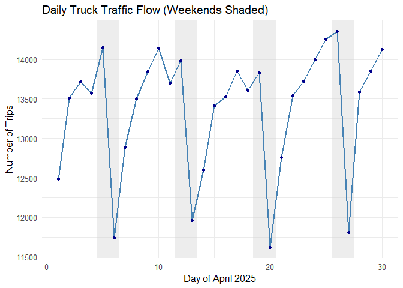
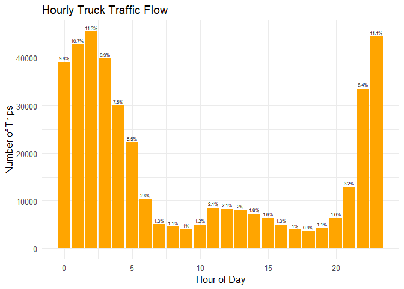
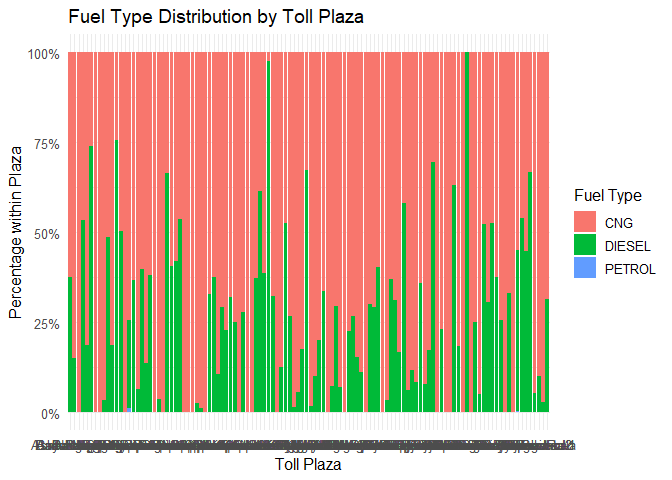
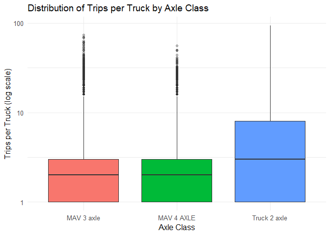

    ## ── Attaching core tidyverse packages ──────────────────────── tidyverse 2.0.0 ──
    ## ✔ dplyr     1.1.4     ✔ readr     2.1.5
    ## ✔ forcats   1.0.0     ✔ stringr   1.5.1
    ## ✔ ggplot2   3.5.2     ✔ tibble    3.3.0
    ## ✔ lubridate 1.9.4     ✔ tidyr     1.3.1
    ## ✔ purrr     1.1.0     
    ## ── Conflicts ────────────────────────────────────────── tidyverse_conflicts() ──
    ## ✖ dplyr::filter() masks stats::filter()
    ## ✖ dplyr::lag()    masks stats::lag()
    ## ℹ Use the conflicted package (<http://conflicted.r-lib.org/>) to force all conflicts to become errors

# Truck Traffic Patterns in Delhi: Insights from RFID Toll Data

This report analyzes RFID-based toll plaza data to understand the
movement of trucks entering Delhi. The focus is on vehicle mix, fuel
types, temporal patterns, and plaza-level variations. Key findings
include:

Axle distribution: The majority of trips are made by 2-axle trucks, but
repeat entries are disproportionately associated with heavier 3- and
4+-axle trucks.

Fuel use: Diesel dominates truck traffic, though CNG adoption is
emerging, particularly among lighter 2-axle trucks and at specific
plazas.

Temporal patterns: Most truck movements occur during night hours (10 pm
– 6 am), consistent with Delhi’s regulatory restrictions. However, CNG
trucks are more evenly spread across the day compared to diesel trucks.

Repeat entries: Trucks with periodic RFID tags tend to make more
frequent trips, though they form only a small share of the fleet.

Bypass movements: Very few trucks are observed entering through one toll
plaza and re-entering through another, suggesting bypass traffic around
Delhi remains limited.

These insights can help refine the classification of toll plazas into
major vs. minor corridors, assess the effectiveness of CNG policies, and
identify potential choke points for freight regulation.

Delhi imposes strict regulations on truck entry, allowing heavy vehicles
to enter primarily during **night hours** to reduce daytime congestion
and pollution. With increasing adoption of RFID tags, toll data now
provides an opportunity to examine **when, where, and what types of
trucks** are entering the city.

This report uses transaction-level RFID data from multiple toll plazas
in April 2025. We analyze axle distribution, fuel choice, temporal
patterns, and plaza-level differences. The findings provide evidence for
ongoing discussions between MCD, CSE, and policymakers on freight
regulation and clean fuel transition.

## Summary statistics

    ## $total_days
    ## [1] 30
    ## 
    ## $total_plazas
    ## [1] 121
    ## 
    ## $total_trips
    ## [1] 3359865
    ## 
    ## $total_vehicle_types
    ## 
    ##                 Bus       Car/3 wheeler                 LCV Light Motor Vehicle 
    ##              177640             1303863              306582             1170148 
    ##          MAV 3 axle          MAV 4 AXLE        Truck 2 axle 
    ##               65616               94336              241680

    ## $total_days
    ## [1] 30
    ## 
    ## $total_plazas
    ## [1] 114
    ## 
    ## $total_trips
    ## [1] 401632
    ## 
    ## $total_vehicle_types
    ## 
    ##   MAV 3 axle   MAV 4 AXLE Truck 2 axle 
    ##        65616        94336       241680

-   total number of truck entries vs overall vehicle entries into Delhi
-   % unique entries - total num of unique truck entries vs unique
    vehicle entries into Delhi

<!-- -->

    ##              Metric  Value
    ## 1     Total Entries 401632
    ## 2   Unique Vehicles  96419
    ## 3 % Unique Vehicles     24

1.  Trips per truck - 1.1 Avg. no. of entries per unique truck - total
    entries divided by unique trucks 1.2 % of trucks seen once, 2-5
    times, 5-10 times, etc. - count of trucks in each frequency bucket
    divided by total unique trucks
2.  Share of traffic generated by a small % of frequent trucks - % of
    trucks (unique vehicles) and % of total trips (entries) they
    contribute
3.  Avg. time between consecutive / repeat entries

<!-- -->

    ##    Min. 1st Qu.  Median    Mean 3rd Qu.    Max. 
    ##   1.000   1.000   2.000   4.165   4.000  93.000

    ## # A tibble: 4 × 3
    ##   bucket         n  perc
    ##   <chr>      <int> <dbl>
    ## 1 1 time     36103  37.4
    ## 2 10+ times   9637  10  
    ## 3 2–5 times  40678  42.2
    ## 4 6–10 times 10001  10.4

    ## # A tibble: 1 × 1
    ##   share
    ##   <dbl>
    ## 1  42.7

For every data point and insight, compare total entries with unique
entries to identify discrepancies. For e.g., if ~80% of total entries
are from CNG trucks but only ~50% of unique trucks are CNG (as we’ve
seen), it implies that CNG trucks are more likely to make repeat trips.
Similar comparisons across other data-points can reveal similar
insights.

### Timestamps

1.  Daily/hourly traffic flow - either no. of trucks or % of trucks
    against total vehicles hourly / daily
2.  Weekday vs weekend traffic flow - no. or % of trucks on weekday &
    weekend

<table>
<caption>Total truck trips per day (April 2025)</caption>
<thead>
<tr>
<th style="text-align: right;">Date</th>
<th style="text-align: right;">Trips</th>
</tr>
</thead>
<tbody>
<tr>
<td style="text-align: right;">1</td>
<td style="text-align: right;">12486</td>
</tr>
<tr>
<td style="text-align: right;">2</td>
<td style="text-align: right;">13512</td>
</tr>
<tr>
<td style="text-align: right;">3</td>
<td style="text-align: right;">13718</td>
</tr>
<tr>
<td style="text-align: right;">4</td>
<td style="text-align: right;">13569</td>
</tr>
<tr>
<td style="text-align: right;">5</td>
<td style="text-align: right;">14149</td>
</tr>
<tr>
<td style="text-align: right;">6</td>
<td style="text-align: right;">11744</td>
</tr>
<tr>
<td style="text-align: right;">7</td>
<td style="text-align: right;">12889</td>
</tr>
<tr>
<td style="text-align: right;">8</td>
<td style="text-align: right;">13501</td>
</tr>
<tr>
<td style="text-align: right;">9</td>
<td style="text-align: right;">13847</td>
</tr>
<tr>
<td style="text-align: right;">10</td>
<td style="text-align: right;">14139</td>
</tr>
<tr>
<td style="text-align: right;">11</td>
<td style="text-align: right;">13698</td>
</tr>
<tr>
<td style="text-align: right;">12</td>
<td style="text-align: right;">13982</td>
</tr>
<tr>
<td style="text-align: right;">13</td>
<td style="text-align: right;">11961</td>
</tr>
<tr>
<td style="text-align: right;">14</td>
<td style="text-align: right;">12600</td>
</tr>
<tr>
<td style="text-align: right;">15</td>
<td style="text-align: right;">13412</td>
</tr>
<tr>
<td style="text-align: right;">16</td>
<td style="text-align: right;">13525</td>
</tr>
<tr>
<td style="text-align: right;">17</td>
<td style="text-align: right;">13852</td>
</tr>
<tr>
<td style="text-align: right;">18</td>
<td style="text-align: right;">13612</td>
</tr>
<tr>
<td style="text-align: right;">19</td>
<td style="text-align: right;">13833</td>
</tr>
<tr>
<td style="text-align: right;">20</td>
<td style="text-align: right;">11617</td>
</tr>
<tr>
<td style="text-align: right;">21</td>
<td style="text-align: right;">12756</td>
</tr>
<tr>
<td style="text-align: right;">22</td>
<td style="text-align: right;">13538</td>
</tr>
<tr>
<td style="text-align: right;">23</td>
<td style="text-align: right;">13721</td>
</tr>
<tr>
<td style="text-align: right;">24</td>
<td style="text-align: right;">14000</td>
</tr>
<tr>
<td style="text-align: right;">25</td>
<td style="text-align: right;">14253</td>
</tr>
<tr>
<td style="text-align: right;">26</td>
<td style="text-align: right;">14350</td>
</tr>
<tr>
<td style="text-align: right;">27</td>
<td style="text-align: right;">11807</td>
</tr>
<tr>
<td style="text-align: right;">28</td>
<td style="text-align: right;">13589</td>
</tr>
<tr>
<td style="text-align: right;">29</td>
<td style="text-align: right;">13849</td>
</tr>
<tr>
<td style="text-align: right;">30</td>
<td style="text-align: right;">14123</td>
</tr>
</tbody>
</table>

<table>
<caption>Hourly distribution of truck trips</caption>
<thead>
<tr>
<th style="text-align: right;">Hour</th>
<th style="text-align: right;">Trips</th>
<th style="text-align: right;">perc</th>
</tr>
</thead>
<tbody>
<tr>
<td style="text-align: right;">0</td>
<td style="text-align: right;">39167</td>
<td style="text-align: right;">9.8</td>
</tr>
<tr>
<td style="text-align: right;">1</td>
<td style="text-align: right;">42876</td>
<td style="text-align: right;">10.7</td>
</tr>
<tr>
<td style="text-align: right;">2</td>
<td style="text-align: right;">45505</td>
<td style="text-align: right;">11.3</td>
</tr>
<tr>
<td style="text-align: right;">3</td>
<td style="text-align: right;">39927</td>
<td style="text-align: right;">9.9</td>
</tr>
<tr>
<td style="text-align: right;">4</td>
<td style="text-align: right;">30083</td>
<td style="text-align: right;">7.5</td>
</tr>
<tr>
<td style="text-align: right;">5</td>
<td style="text-align: right;">22253</td>
<td style="text-align: right;">5.5</td>
</tr>
<tr>
<td style="text-align: right;">6</td>
<td style="text-align: right;">10298</td>
<td style="text-align: right;">2.6</td>
</tr>
<tr>
<td style="text-align: right;">7</td>
<td style="text-align: right;">5056</td>
<td style="text-align: right;">1.3</td>
</tr>
<tr>
<td style="text-align: right;">8</td>
<td style="text-align: right;">4548</td>
<td style="text-align: right;">1.1</td>
</tr>
<tr>
<td style="text-align: right;">9</td>
<td style="text-align: right;">4061</td>
<td style="text-align: right;">1.0</td>
</tr>
<tr>
<td style="text-align: right;">10</td>
<td style="text-align: right;">4981</td>
<td style="text-align: right;">1.2</td>
</tr>
<tr>
<td style="text-align: right;">11</td>
<td style="text-align: right;">8562</td>
<td style="text-align: right;">2.1</td>
</tr>
<tr>
<td style="text-align: right;">12</td>
<td style="text-align: right;">8318</td>
<td style="text-align: right;">2.1</td>
</tr>
<tr>
<td style="text-align: right;">13</td>
<td style="text-align: right;">8034</td>
<td style="text-align: right;">2.0</td>
</tr>
<tr>
<td style="text-align: right;">14</td>
<td style="text-align: right;">7302</td>
<td style="text-align: right;">1.8</td>
</tr>
<tr>
<td style="text-align: right;">15</td>
<td style="text-align: right;">6388</td>
<td style="text-align: right;">1.6</td>
</tr>
<tr>
<td style="text-align: right;">16</td>
<td style="text-align: right;">5039</td>
<td style="text-align: right;">1.3</td>
</tr>
<tr>
<td style="text-align: right;">17</td>
<td style="text-align: right;">3955</td>
<td style="text-align: right;">1.0</td>
</tr>
<tr>
<td style="text-align: right;">18</td>
<td style="text-align: right;">3607</td>
<td style="text-align: right;">0.9</td>
</tr>
<tr>
<td style="text-align: right;">19</td>
<td style="text-align: right;">4298</td>
<td style="text-align: right;">1.1</td>
</tr>
<tr>
<td style="text-align: right;">20</td>
<td style="text-align: right;">6369</td>
<td style="text-align: right;">1.6</td>
</tr>
<tr>
<td style="text-align: right;">21</td>
<td style="text-align: right;">12867</td>
<td style="text-align: right;">3.2</td>
</tr>
<tr>
<td style="text-align: right;">22</td>
<td style="text-align: right;">33591</td>
<td style="text-align: right;">8.4</td>
</tr>
<tr>
<td style="text-align: right;">23</td>
<td style="text-align: right;">44547</td>
<td style="text-align: right;">11.1</td>
</tr>
</tbody>
</table>

<table>
<caption>Weekday vs. Weekend truck traffic</caption>
<thead>
<tr>
<th style="text-align: left;">weekend</th>
<th style="text-align: right;">n</th>
<th style="text-align: right;">Percentage</th>
</tr>
</thead>
<tbody>
<tr>
<td style="text-align: left;">Weekday</td>
<td style="text-align: right;">298189</td>
<td style="text-align: right;">74.2</td>
</tr>
<tr>
<td style="text-align: left;">Weekend</td>
<td style="text-align: right;">103443</td>
<td style="text-align: right;">25.8</td>
</tr>
</tbody>
</table>

#### Truck Timing Compliance and Diurnal Patterns

We overlay regulatory time windows onto the hourly traffic distribution
to observe how vehicle types align with permitted travel times.

LGVs (light goods vehicles) are not allowed from 7 am–11 am and 5 pm–11
pm, marked by red shading.

HGVs/MGVs face longer restrictions during daytime—blue shading
demonstrates these hours.

Traffic peaks around midnight–early morning correspond to lifted
restrictions, as reflected by our data.

Conversely, major troughs align with restricted intervals, indicating
compliance or enforcement effectiveness.

### Toll Plaza

-   % of total entries by plaza (for the whole month)
-   % of unique entries by plaza (for the whole month)
-   1.  No. of repeat trips per plaza

<!-- -->

    ## # A tibble: 114 × 3
    ##    Plaza                     n  perc
    ##    <chr>                 <int> <dbl>
    ##  1 Aaya Nagar             3272   0.8
    ##  2 Ashok Nagar-1           433   0.1
    ##  3 Ashok Nagar-2             1   0  
    ##  4 Auchandi 1             9065   2.3
    ##  5 Auchandi 2              101   0  
    ##  6 Badarpur              42890  10.7
    ##  7 Badshahpura galipur       8   0  
    ##  8 Badshahpura galipur-2     1   0  
    ##  9 Bahghera Bypass         141   0  
    ## 10 Bajghera              21545   5.4
    ## # ℹ 104 more rows

### Vehicle Class

1.  Axle distribution - % of all trips made by 2-axle vs. 3-axle vs. 4+
    axle trucks

(do this for total and unique entries)

<table>
<caption>Distribution of all trips by axle category</caption>
<thead>
<tr>
<th style="text-align: left;">Vehicle Class</th>
<th style="text-align: right;">Trips</th>
<th style="text-align: right;">% of Trips</th>
</tr>
</thead>
<tbody>
<tr>
<td style="text-align: left;">MAV 3 axle</td>
<td style="text-align: right;">65616</td>
<td style="text-align: right;">16.3</td>
</tr>
<tr>
<td style="text-align: left;">MAV 4 AXLE</td>
<td style="text-align: right;">94336</td>
<td style="text-align: right;">23.5</td>
</tr>
<tr>
<td style="text-align: left;">Truck 2 axle</td>
<td style="text-align: right;">241680</td>
<td style="text-align: right;">60.2</td>
</tr>
</tbody>
</table>

<table>
<caption>Distribution of unique trucks by axle category</caption>
<thead>
<tr>
<th style="text-align: left;">Vehicle Class</th>
<th style="text-align: right;">Unique Trucks</th>
<th style="text-align: right;">% of Unique Trucks</th>
</tr>
</thead>
<tbody>
<tr>
<td style="text-align: left;">MAV 3 axle</td>
<td style="text-align: right;">19612</td>
<td style="text-align: right;">20.3</td>
</tr>
<tr>
<td style="text-align: left;">MAV 4 AXLE</td>
<td style="text-align: right;">33080</td>
<td style="text-align: right;">34.3</td>
</tr>
<tr>
<td style="text-align: left;">Truck 2 axle</td>
<td style="text-align: right;">43727</td>
<td style="text-align: right;">45.4</td>
</tr>
</tbody>
</table>

### RFID Tag Type

1.  % split of trip-based vs. periodic
2.  No. of repeat entry trucks who’ve opted for RFID

<table>
<caption>RFID Tag Type split across all trips</caption>
<thead>
<tr>
<th style="text-align: left;">Pass Type</th>
<th style="text-align: right;">Trips</th>
<th style="text-align: right;">% of Trips</th>
</tr>
</thead>
<tbody>
<tr>
<td style="text-align: left;">Periodic</td>
<td style="text-align: right;">14878</td>
<td style="text-align: right;">3.7</td>
</tr>
<tr>
<td style="text-align: left;">Trip-Based</td>
<td style="text-align: right;">386754</td>
<td style="text-align: right;">96.3</td>
</tr>
</tbody>
</table>

<table>
<caption>RFID Tag Types among repeat-entry trucks</caption>
<thead>
<tr>
<th style="text-align: left;">Tag Type</th>
<th style="text-align: right;">Repeat-entry Trucks</th>
<th style="text-align: right;">% of Repeat Trucks</th>
</tr>
</thead>
<tbody>
<tr>
<td style="text-align: left;">Periodic</td>
<td style="text-align: right;">909</td>
<td style="text-align: right;">1.5</td>
</tr>
<tr>
<td style="text-align: left;">Trip-Based</td>
<td style="text-align: right;">59407</td>
<td style="text-align: right;">98.5</td>
</tr>
</tbody>
</table>

### Fuel Type

1.  % split of trucks by fuel type - % CNG, diesel, & petrol (if any)
    truck split (for total and unique RFID)

<table>
<caption>Fuel Type split across all trips</caption>
<thead>
<tr>
<th style="text-align: left;">Fuel Type</th>
<th style="text-align: right;">Trips</th>
<th style="text-align: right;">% of Trips</th>
</tr>
</thead>
<tbody>
<tr>
<td style="text-align: left;">CNG</td>
<td style="text-align: right;">197721</td>
<td style="text-align: right;">49.2</td>
</tr>
<tr>
<td style="text-align: left;">DIESEL</td>
<td style="text-align: right;">203630</td>
<td style="text-align: right;">50.7</td>
</tr>
<tr>
<td style="text-align: left;">PETROL</td>
<td style="text-align: right;">281</td>
<td style="text-align: right;">0.1</td>
</tr>
</tbody>
</table>

<table>
<caption>Fuel Type split across unique trucks (RFID)</caption>
<thead>
<tr>
<th style="text-align: left;">Fuel Type</th>
<th style="text-align: right;">Unique Trucks</th>
<th style="text-align: right;">% of Trucks</th>
</tr>
</thead>
<tbody>
<tr>
<td style="text-align: left;">CNG</td>
<td style="text-align: right;">19402</td>
<td style="text-align: right;">20.1</td>
</tr>
<tr>
<td style="text-align: left;">DIESEL</td>
<td style="text-align: right;">76921</td>
<td style="text-align: right;">79.8</td>
</tr>
<tr>
<td style="text-align: left;">PETROL</td>
<td style="text-align: right;">96</td>
<td style="text-align: right;">0.1</td>
</tr>
</tbody>
</table>

## Cross tabulated insights

-   Are heavier trucks more likely to be diesel? Or are lighter trucks
    disproportionately CNG? (Fuel Type and Vehicle Class)

<table>
<caption>Fuel Type by Vehicle Class (counts and percentages within
class)</caption>
<colgroup>
<col style="width: 19%" />
<col style="width: 9%" />
<col style="width: 12%" />
<col style="width: 12%" />
<col style="width: 12%" />
<col style="width: 16%" />
<col style="width: 16%" />
</colgroup>
<thead>
<tr>
<th style="text-align: left;">Vehicle Class</th>
<th style="text-align: right;">n_CNG</th>
<th style="text-align: right;">n_DIESEL</th>
<th style="text-align: right;">n_PETROL</th>
<th style="text-align: right;">perc_CNG</th>
<th style="text-align: right;">perc_DIESEL</th>
<th style="text-align: right;">perc_PETROL</th>
</tr>
</thead>
<tbody>
<tr>
<td style="text-align: left;">MAV 3 axle</td>
<td style="text-align: right;">20790</td>
<td style="text-align: right;">44750</td>
<td style="text-align: right;">76</td>
<td style="text-align: right;">31.7</td>
<td style="text-align: right;">68.2</td>
<td style="text-align: right;">0.1</td>
</tr>
<tr>
<td style="text-align: left;">MAV 4 AXLE</td>
<td style="text-align: right;">13887</td>
<td style="text-align: right;">80383</td>
<td style="text-align: right;">66</td>
<td style="text-align: right;">14.7</td>
<td style="text-align: right;">85.2</td>
<td style="text-align: right;">0.1</td>
</tr>
<tr>
<td style="text-align: left;">Truck 2 axle</td>
<td style="text-align: right;">163044</td>
<td style="text-align: right;">78497</td>
<td style="text-align: right;">139</td>
<td style="text-align: right;">67.5</td>
<td style="text-align: right;">32.5</td>
<td style="text-align: right;">0.1</td>
</tr>
</tbody>
</table>

<table>
<caption>Fuel Type by Vehicle Class (unique trucks, counts and
percentages within class)</caption>
<colgroup>
<col style="width: 19%" />
<col style="width: 8%" />
<col style="width: 12%" />
<col style="width: 12%" />
<col style="width: 12%" />
<col style="width: 16%" />
<col style="width: 16%" />
</colgroup>
<thead>
<tr>
<th style="text-align: left;">vehicle_class</th>
<th style="text-align: right;">n_CNG</th>
<th style="text-align: right;">n_DIESEL</th>
<th style="text-align: right;">n_PETROL</th>
<th style="text-align: right;">perc_CNG</th>
<th style="text-align: right;">perc_DIESEL</th>
<th style="text-align: right;">perc_PETROL</th>
</tr>
</thead>
<tbody>
<tr>
<td style="text-align: left;">MAV 3 axle</td>
<td style="text-align: right;">1463</td>
<td style="text-align: right;">18120</td>
<td style="text-align: right;">29</td>
<td style="text-align: right;">7.5</td>
<td style="text-align: right;">92.4</td>
<td style="text-align: right;">0.1</td>
</tr>
<tr>
<td style="text-align: left;">MAV 4 AXLE</td>
<td style="text-align: right;">1132</td>
<td style="text-align: right;">31915</td>
<td style="text-align: right;">33</td>
<td style="text-align: right;">3.4</td>
<td style="text-align: right;">96.5</td>
<td style="text-align: right;">0.1</td>
</tr>
<tr>
<td style="text-align: left;">Truck 2 axle</td>
<td style="text-align: right;">16807</td>
<td style="text-align: right;">26886</td>
<td style="text-align: right;">34</td>
<td style="text-align: right;">38.4</td>
<td style="text-align: right;">61.5</td>
<td style="text-align: right;">0.1</td>
</tr>
</tbody>
</table>

-   Are CNG Trucks likelier to be repeat entrants than diesel? (Fuel
    Type & trips per truck)

<table>
<caption>Repeat Entry Rates by Fuel Type</caption>
<colgroup>
<col style="width: 8%" />
<col style="width: 20%" />
<col style="width: 20%" />
<col style="width: 24%" />
<col style="width: 24%" />
</colgroup>
<thead>
<tr>
<th style="text-align: left;">fuel</th>
<th style="text-align: right;">n_Repeat Entrant</th>
<th style="text-align: right;">n_Single Entrant</th>
<th style="text-align: right;">perc_Repeat Entrant</th>
<th style="text-align: right;">perc_Single Entrant</th>
</tr>
</thead>
<tbody>
<tr>
<td style="text-align: left;">CNG</td>
<td style="text-align: right;">17816</td>
<td style="text-align: right;">1586</td>
<td style="text-align: right;">91.8</td>
<td style="text-align: right;">8.2</td>
</tr>
<tr>
<td style="text-align: left;">DIESEL</td>
<td style="text-align: right;">42441</td>
<td style="text-align: right;">34480</td>
<td style="text-align: right;">55.2</td>
<td style="text-align: right;">44.8</td>
</tr>
<tr>
<td style="text-align: left;">PETROL</td>
<td style="text-align: right;">59</td>
<td style="text-align: right;">37</td>
<td style="text-align: right;">61.5</td>
<td style="text-align: right;">38.5</td>
</tr>
</tbody>
</table>

<table>
<caption>Trips per Truck by Fuel Type</caption>
<thead>
<tr>
<th style="text-align: left;">Fuel Type</th>
<th style="text-align: right;">Average Trips per Truck</th>
<th style="text-align: right;">Median Trips</th>
<th style="text-align: right;">Maximum Trips</th>
</tr>
</thead>
<tbody>
<tr>
<td style="text-align: left;">CNG</td>
<td style="text-align: right;">10.19</td>
<td style="text-align: right;">9</td>
<td style="text-align: right;">93</td>
</tr>
<tr>
<td style="text-align: left;">DIESEL</td>
<td style="text-align: right;">2.65</td>
<td style="text-align: right;">2</td>
<td style="text-align: right;">56</td>
</tr>
<tr>
<td style="text-align: left;">PETROL</td>
<td style="text-align: right;">2.93</td>
<td style="text-align: right;">2</td>
<td style="text-align: right;">27</td>
</tr>
</tbody>
</table>

-   Do certain plazas see more CNG or diesel truck traffic inflow? (Fuel
    type and toll plaza)

<table>
<caption>Fuel Type Distribution by Toll Plaza (counts and % within
plaza)</caption>
<colgroup>
<col style="width: 27%" />
<col style="width: 7%" />
<col style="width: 11%" />
<col style="width: 11%" />
<col style="width: 11%" />
<col style="width: 15%" />
<col style="width: 15%" />
</colgroup>
<thead>
<tr>
<th style="text-align: left;">Plaza</th>
<th style="text-align: right;">n_CNG</th>
<th style="text-align: right;">n_DIESEL</th>
<th style="text-align: right;">n_PETROL</th>
<th style="text-align: right;">perc_CNG</th>
<th style="text-align: right;">perc_DIESEL</th>
<th style="text-align: right;">perc_PETROL</th>
</tr>
</thead>
<tbody>
<tr>
<td style="text-align: left;">Aaya Nagar</td>
<td style="text-align: right;">2041</td>
<td style="text-align: right;">1230</td>
<td style="text-align: right;">1</td>
<td style="text-align: right;">62.4</td>
<td style="text-align: right;">37.6</td>
<td style="text-align: right;">0.0</td>
</tr>
<tr>
<td style="text-align: left;">Ashok Nagar-1</td>
<td style="text-align: right;">368</td>
<td style="text-align: right;">64</td>
<td style="text-align: right;">1</td>
<td style="text-align: right;">85.0</td>
<td style="text-align: right;">14.8</td>
<td style="text-align: right;">0.2</td>
</tr>
<tr>
<td style="text-align: left;">Ashok Nagar-2</td>
<td style="text-align: right;">1</td>
<td style="text-align: right;">0</td>
<td style="text-align: right;">0</td>
<td style="text-align: right;">100.0</td>
<td style="text-align: right;">0.0</td>
<td style="text-align: right;">0.0</td>
</tr>
<tr>
<td style="text-align: left;">Auchandi 1</td>
<td style="text-align: right;">4226</td>
<td style="text-align: right;">4836</td>
<td style="text-align: right;">3</td>
<td style="text-align: right;">46.6</td>
<td style="text-align: right;">53.3</td>
<td style="text-align: right;">0.0</td>
</tr>
<tr>
<td style="text-align: left;">Auchandi 2</td>
<td style="text-align: right;">82</td>
<td style="text-align: right;">19</td>
<td style="text-align: right;">0</td>
<td style="text-align: right;">81.2</td>
<td style="text-align: right;">18.8</td>
<td style="text-align: right;">0.0</td>
</tr>
<tr>
<td style="text-align: left;">Badarpur</td>
<td style="text-align: right;">11088</td>
<td style="text-align: right;">31728</td>
<td style="text-align: right;">74</td>
<td style="text-align: right;">25.9</td>
<td style="text-align: right;">74.0</td>
<td style="text-align: right;">0.2</td>
</tr>
<tr>
<td style="text-align: left;">Badshahpura galipur</td>
<td style="text-align: right;">8</td>
<td style="text-align: right;">0</td>
<td style="text-align: right;">0</td>
<td style="text-align: right;">100.0</td>
<td style="text-align: right;">0.0</td>
<td style="text-align: right;">0.0</td>
</tr>
<tr>
<td style="text-align: left;">Badshahpura galipur-2</td>
<td style="text-align: right;">1</td>
<td style="text-align: right;">0</td>
<td style="text-align: right;">0</td>
<td style="text-align: right;">100.0</td>
<td style="text-align: right;">0.0</td>
<td style="text-align: right;">0.0</td>
</tr>
<tr>
<td style="text-align: left;">Bahghera Bypass</td>
<td style="text-align: right;">136</td>
<td style="text-align: right;">5</td>
<td style="text-align: right;">0</td>
<td style="text-align: right;">96.5</td>
<td style="text-align: right;">3.5</td>
<td style="text-align: right;">0.0</td>
</tr>
<tr>
<td style="text-align: left;">Bajghera</td>
<td style="text-align: right;">11043</td>
<td style="text-align: right;">10498</td>
<td style="text-align: right;">4</td>
<td style="text-align: right;">51.3</td>
<td style="text-align: right;">48.7</td>
<td style="text-align: right;">0.0</td>
</tr>
<tr>
<td style="text-align: left;">Bakarghad</td>
<td style="text-align: right;">2338</td>
<td style="text-align: right;">541</td>
<td style="text-align: right;">0</td>
<td style="text-align: right;">81.2</td>
<td style="text-align: right;">18.8</td>
<td style="text-align: right;">0.0</td>
</tr>
<tr>
<td style="text-align: left;">Bankner</td>
<td style="text-align: right;">8</td>
<td style="text-align: right;">25</td>
<td style="text-align: right;">0</td>
<td style="text-align: right;">24.2</td>
<td style="text-align: right;">75.8</td>
<td style="text-align: right;">0.0</td>
</tr>
<tr>
<td style="text-align: left;">Baswara</td>
<td style="text-align: right;">1534</td>
<td style="text-align: right;">1551</td>
<td style="text-align: right;">2</td>
<td style="text-align: right;">49.7</td>
<td style="text-align: right;">50.2</td>
<td style="text-align: right;">0.1</td>
</tr>
<tr>
<td style="text-align: left;">Between-2</td>
<td style="text-align: right;">1</td>
<td style="text-align: right;">0</td>
<td style="text-align: right;">0</td>
<td style="text-align: right;">100.0</td>
<td style="text-align: right;">0.0</td>
<td style="text-align: right;">0.0</td>
</tr>
<tr>
<td style="text-align: left;">Chander Nagar</td>
<td style="text-align: right;">923</td>
<td style="text-align: right;">304</td>
<td style="text-align: right;">14</td>
<td style="text-align: right;">74.4</td>
<td style="text-align: right;">24.5</td>
<td style="text-align: right;">1.1</td>
</tr>
<tr>
<td style="text-align: left;">Chor Naka</td>
<td style="text-align: right;">84</td>
<td style="text-align: right;">49</td>
<td style="text-align: right;">0</td>
<td style="text-align: right;">63.2</td>
<td style="text-align: right;">36.8</td>
<td style="text-align: right;">0.0</td>
</tr>
<tr>
<td style="text-align: left;">DND</td>
<td style="text-align: right;">4698</td>
<td style="text-align: right;">9341</td>
<td style="text-align: right;">14</td>
<td style="text-align: right;">33.4</td>
<td style="text-align: right;">66.5</td>
<td style="text-align: right;">0.1</td>
</tr>
<tr>
<td style="text-align: left;">Darola Border-1</td>
<td style="text-align: right;">1942</td>
<td style="text-align: right;">132</td>
<td style="text-align: right;">0</td>
<td style="text-align: right;">93.6</td>
<td style="text-align: right;">6.4</td>
<td style="text-align: right;">0.0</td>
</tr>
<tr>
<td style="text-align: left;">Darola Border-2</td>
<td style="text-align: right;">38</td>
<td style="text-align: right;">25</td>
<td style="text-align: right;">0</td>
<td style="text-align: right;">60.3</td>
<td style="text-align: right;">39.7</td>
<td style="text-align: right;">0.0</td>
</tr>
<tr>
<td style="text-align: left;">Dhansa Border</td>
<td style="text-align: right;">7920</td>
<td style="text-align: right;">1248</td>
<td style="text-align: right;">1</td>
<td style="text-align: right;">86.4</td>
<td style="text-align: right;">13.6</td>
<td style="text-align: right;">0.0</td>
</tr>
<tr>
<td style="text-align: left;">Dharamkanta</td>
<td style="text-align: right;">34</td>
<td style="text-align: right;">21</td>
<td style="text-align: right;">0</td>
<td style="text-align: right;">61.8</td>
<td style="text-align: right;">38.2</td>
<td style="text-align: right;">0.0</td>
</tr>
<tr>
<td style="text-align: left;">Dharamkanta 2nd</td>
<td style="text-align: right;">1</td>
<td style="text-align: right;">0</td>
<td style="text-align: right;">0</td>
<td style="text-align: right;">100.0</td>
<td style="text-align: right;">0.0</td>
<td style="text-align: right;">0.0</td>
</tr>
<tr>
<td style="text-align: left;">Diwarkhana-1</td>
<td style="text-align: right;">52</td>
<td style="text-align: right;">2</td>
<td style="text-align: right;">0</td>
<td style="text-align: right;">96.3</td>
<td style="text-align: right;">3.7</td>
<td style="text-align: right;">0.0</td>
</tr>
<tr>
<td style="text-align: left;">Diwarkhana-2</td>
<td style="text-align: right;">10</td>
<td style="text-align: right;">0</td>
<td style="text-align: right;">0</td>
<td style="text-align: right;">100.0</td>
<td style="text-align: right;">0.0</td>
<td style="text-align: right;">0.0</td>
</tr>
<tr>
<td style="text-align: left;">Gazipur Main</td>
<td style="text-align: right;">15676</td>
<td style="text-align: right;">10714</td>
<td style="text-align: right;">28</td>
<td style="text-align: right;">59.3</td>
<td style="text-align: right;">40.6</td>
<td style="text-align: right;">0.1</td>
</tr>
<tr>
<td style="text-align: left;">Gazipur Old</td>
<td style="text-align: right;">4824</td>
<td style="text-align: right;">3487</td>
<td style="text-align: right;">8</td>
<td style="text-align: right;">58.0</td>
<td style="text-align: right;">41.9</td>
<td style="text-align: right;">0.1</td>
</tr>
<tr>
<td style="text-align: left;">Harewali 1</td>
<td style="text-align: right;">2745</td>
<td style="text-align: right;">3171</td>
<td style="text-align: right;">0</td>
<td style="text-align: right;">46.4</td>
<td style="text-align: right;">53.6</td>
<td style="text-align: right;">0.0</td>
</tr>
<tr>
<td style="text-align: left;">Indrapuri</td>
<td style="text-align: right;">4</td>
<td style="text-align: right;">0</td>
<td style="text-align: right;">0</td>
<td style="text-align: right;">100.0</td>
<td style="text-align: right;">0.0</td>
<td style="text-align: right;">0.0</td>
</tr>
<tr>
<td style="text-align: left;">Indrapuri 3rd</td>
<td style="text-align: right;">12</td>
<td style="text-align: right;">0</td>
<td style="text-align: right;">0</td>
<td style="text-align: right;">100.0</td>
<td style="text-align: right;">0.0</td>
<td style="text-align: right;">0.0</td>
</tr>
<tr>
<td style="text-align: left;">Ishapur</td>
<td style="text-align: right;">11</td>
<td style="text-align: right;">0</td>
<td style="text-align: right;">0</td>
<td style="text-align: right;">100.0</td>
<td style="text-align: right;">0.0</td>
<td style="text-align: right;">0.0</td>
</tr>
<tr>
<td style="text-align: left;">Jaitpura-1</td>
<td style="text-align: right;">73</td>
<td style="text-align: right;">2</td>
<td style="text-align: right;">0</td>
<td style="text-align: right;">97.3</td>
<td style="text-align: right;">2.7</td>
<td style="text-align: right;">0.0</td>
</tr>
<tr>
<td style="text-align: left;">Jaitpura-2</td>
<td style="text-align: right;">82</td>
<td style="text-align: right;">1</td>
<td style="text-align: right;">0</td>
<td style="text-align: right;">98.8</td>
<td style="text-align: right;">1.2</td>
<td style="text-align: right;">0.0</td>
</tr>
<tr>
<td style="text-align: left;">Jaitpura-3</td>
<td style="text-align: right;">39</td>
<td style="text-align: right;">0</td>
<td style="text-align: right;">0</td>
<td style="text-align: right;">100.0</td>
<td style="text-align: right;">0.0</td>
<td style="text-align: right;">0.0</td>
</tr>
<tr>
<td style="text-align: left;">Jaitpura-4</td>
<td style="text-align: right;">1972</td>
<td style="text-align: right;">967</td>
<td style="text-align: right;">1</td>
<td style="text-align: right;">67.1</td>
<td style="text-align: right;">32.9</td>
<td style="text-align: right;">0.0</td>
</tr>
<tr>
<td style="text-align: left;">Janti Khurd</td>
<td style="text-align: right;">130</td>
<td style="text-align: right;">78</td>
<td style="text-align: right;">0</td>
<td style="text-align: right;">62.5</td>
<td style="text-align: right;">37.5</td>
<td style="text-align: right;">0.0</td>
</tr>
<tr>
<td style="text-align: left;">Jaroda-2</td>
<td style="text-align: right;">117</td>
<td style="text-align: right;">14</td>
<td style="text-align: right;">0</td>
<td style="text-align: right;">89.3</td>
<td style="text-align: right;">10.7</td>
<td style="text-align: right;">0.0</td>
</tr>
<tr>
<td style="text-align: left;">Jharoda</td>
<td style="text-align: right;">4079</td>
<td style="text-align: right;">1680</td>
<td style="text-align: right;">1</td>
<td style="text-align: right;">70.8</td>
<td style="text-align: right;">29.2</td>
<td style="text-align: right;">0.0</td>
</tr>
<tr>
<td style="text-align: left;">Jhati Kara</td>
<td style="text-align: right;">101</td>
<td style="text-align: right;">30</td>
<td style="text-align: right;">0</td>
<td style="text-align: right;">77.1</td>
<td style="text-align: right;">22.9</td>
<td style="text-align: right;">0.0</td>
</tr>
<tr>
<td style="text-align: left;">Jhoripur 1st</td>
<td style="text-align: right;">161</td>
<td style="text-align: right;">76</td>
<td style="text-align: right;">0</td>
<td style="text-align: right;">67.9</td>
<td style="text-align: right;">32.1</td>
<td style="text-align: right;">0.0</td>
</tr>
<tr>
<td style="text-align: left;">Jhoripur 2nd</td>
<td style="text-align: right;">3</td>
<td style="text-align: right;">1</td>
<td style="text-align: right;">0</td>
<td style="text-align: right;">75.0</td>
<td style="text-align: right;">25.0</td>
<td style="text-align: right;">0.0</td>
</tr>
<tr>
<td style="text-align: left;">Jounti 1</td>
<td style="text-align: right;">6</td>
<td style="text-align: right;">0</td>
<td style="text-align: right;">0</td>
<td style="text-align: right;">100.0</td>
<td style="text-align: right;">0.0</td>
<td style="text-align: right;">0.0</td>
</tr>
<tr>
<td style="text-align: left;">Jounti 2</td>
<td style="text-align: right;">153</td>
<td style="text-align: right;">59</td>
<td style="text-align: right;">0</td>
<td style="text-align: right;">72.2</td>
<td style="text-align: right;">27.8</td>
<td style="text-align: right;">0.0</td>
</tr>
<tr>
<td style="text-align: left;">Kair Naka-1</td>
<td style="text-align: right;">7</td>
<td style="text-align: right;">0</td>
<td style="text-align: right;">0</td>
<td style="text-align: right;">100.0</td>
<td style="text-align: right;">0.0</td>
<td style="text-align: right;">0.0</td>
</tr>
<tr>
<td style="text-align: left;">Kair Naka-2</td>
<td style="text-align: right;">36</td>
<td style="text-align: right;">0</td>
<td style="text-align: right;">0</td>
<td style="text-align: right;">100.0</td>
<td style="text-align: right;">0.0</td>
<td style="text-align: right;">0.0</td>
</tr>
<tr>
<td style="text-align: left;">Kalindi Kunj</td>
<td style="text-align: right;">10305</td>
<td style="text-align: right;">6102</td>
<td style="text-align: right;">6</td>
<td style="text-align: right;">62.8</td>
<td style="text-align: right;">37.2</td>
<td style="text-align: right;">0.0</td>
</tr>
<tr>
<td style="text-align: left;">Kapashera</td>
<td style="text-align: right;">1093</td>
<td style="text-align: right;">1754</td>
<td style="text-align: right;">1</td>
<td style="text-align: right;">38.4</td>
<td style="text-align: right;">61.6</td>
<td style="text-align: right;">0.0</td>
</tr>
<tr>
<td style="text-align: left;">Kapashera Bypass</td>
<td style="text-align: right;">138</td>
<td style="text-align: right;">87</td>
<td style="text-align: right;">0</td>
<td style="text-align: right;">61.3</td>
<td style="text-align: right;">38.7</td>
<td style="text-align: right;">0.0</td>
</tr>
<tr>
<td style="text-align: left;">Kapashera CNG</td>
<td style="text-align: right;">3</td>
<td style="text-align: right;">116</td>
<td style="text-align: right;">0</td>
<td style="text-align: right;">2.5</td>
<td style="text-align: right;">97.5</td>
<td style="text-align: right;">0.0</td>
</tr>
<tr>
<td style="text-align: left;">Karawal Nagar</td>
<td style="text-align: right;">341</td>
<td style="text-align: right;">163</td>
<td style="text-align: right;">0</td>
<td style="text-align: right;">67.7</td>
<td style="text-align: right;">32.3</td>
<td style="text-align: right;">0.0</td>
</tr>
<tr>
<td style="text-align: left;">Karawal Nagar 2nd</td>
<td style="text-align: right;">1</td>
<td style="text-align: right;">0</td>
<td style="text-align: right;">0</td>
<td style="text-align: right;">100.0</td>
<td style="text-align: right;">0.0</td>
<td style="text-align: right;">0.0</td>
</tr>
<tr>
<td style="text-align: left;">Kundi 1st</td>
<td style="text-align: right;">228</td>
<td style="text-align: right;">33</td>
<td style="text-align: right;">0</td>
<td style="text-align: right;">87.4</td>
<td style="text-align: right;">12.6</td>
<td style="text-align: right;">0.0</td>
</tr>
<tr>
<td style="text-align: left;">Kundli</td>
<td style="text-align: right;">31600</td>
<td style="text-align: right;">35011</td>
<td style="text-align: right;">52</td>
<td style="text-align: right;">47.4</td>
<td style="text-align: right;">52.5</td>
<td style="text-align: right;">0.1</td>
</tr>
<tr>
<td style="text-align: left;">Kundli-II</td>
<td style="text-align: right;">1149</td>
<td style="text-align: right;">420</td>
<td style="text-align: right;">0</td>
<td style="text-align: right;">73.2</td>
<td style="text-align: right;">26.8</td>
<td style="text-align: right;">0.0</td>
</tr>
<tr>
<td style="text-align: left;">Kutubgarh 1</td>
<td style="text-align: right;">137</td>
<td style="text-align: right;">2</td>
<td style="text-align: right;">0</td>
<td style="text-align: right;">98.6</td>
<td style="text-align: right;">1.4</td>
<td style="text-align: right;">0.0</td>
</tr>
<tr>
<td style="text-align: left;">Kutubgarh 2</td>
<td style="text-align: right;">68</td>
<td style="text-align: right;">4</td>
<td style="text-align: right;">0</td>
<td style="text-align: right;">94.4</td>
<td style="text-align: right;">5.6</td>
<td style="text-align: right;">0.0</td>
</tr>
<tr>
<td style="text-align: left;">Kutubgarh 3</td>
<td style="text-align: right;">179</td>
<td style="text-align: right;">38</td>
<td style="text-align: right;">0</td>
<td style="text-align: right;">82.5</td>
<td style="text-align: right;">17.5</td>
<td style="text-align: right;">0.0</td>
</tr>
<tr>
<td style="text-align: left;">Lampur</td>
<td style="text-align: right;">969</td>
<td style="text-align: right;">1983</td>
<td style="text-align: right;">2</td>
<td style="text-align: right;">32.8</td>
<td style="text-align: right;">67.1</td>
<td style="text-align: right;">0.1</td>
</tr>
<tr>
<td style="text-align: left;">Loni 2nd</td>
<td style="text-align: right;">153</td>
<td style="text-align: right;">3</td>
<td style="text-align: right;">0</td>
<td style="text-align: right;">98.1</td>
<td style="text-align: right;">1.9</td>
<td style="text-align: right;">0.0</td>
</tr>
<tr>
<td style="text-align: left;">Loni Main</td>
<td style="text-align: right;">5532</td>
<td style="text-align: right;">617</td>
<td style="text-align: right;">2</td>
<td style="text-align: right;">89.9</td>
<td style="text-align: right;">10.0</td>
<td style="text-align: right;">0.0</td>
</tr>
<tr>
<td style="text-align: left;">Mandoli 2nd</td>
<td style="text-align: right;">4</td>
<td style="text-align: right;">1</td>
<td style="text-align: right;">0</td>
<td style="text-align: right;">80.0</td>
<td style="text-align: right;">20.0</td>
<td style="text-align: right;">0.0</td>
</tr>
<tr>
<td style="text-align: left;">Mandoli Main</td>
<td style="text-align: right;">6507</td>
<td style="text-align: right;">3291</td>
<td style="text-align: right;">3</td>
<td style="text-align: right;">66.4</td>
<td style="text-align: right;">33.6</td>
<td style="text-align: right;">0.0</td>
</tr>
<tr>
<td style="text-align: left;">Mayur Vihar</td>
<td style="text-align: right;">4</td>
<td style="text-align: right;">0</td>
<td style="text-align: right;">0</td>
<td style="text-align: right;">100.0</td>
<td style="text-align: right;">0.0</td>
<td style="text-align: right;">0.0</td>
</tr>
<tr>
<td style="text-align: left;">Mayur Vihar Phase</td>
<td style="text-align: right;">51</td>
<td style="text-align: right;">4</td>
<td style="text-align: right;">0</td>
<td style="text-align: right;">92.7</td>
<td style="text-align: right;">7.3</td>
<td style="text-align: right;">0.0</td>
</tr>
<tr>
<td style="text-align: left;">Mohan Nagar</td>
<td style="text-align: right;">50</td>
<td style="text-align: right;">21</td>
<td style="text-align: right;">0</td>
<td style="text-align: right;">70.4</td>
<td style="text-align: right;">29.6</td>
<td style="text-align: right;">0.0</td>
</tr>
<tr>
<td style="text-align: left;">Mundela Kalan-1</td>
<td style="text-align: right;">318</td>
<td style="text-align: right;">24</td>
<td style="text-align: right;">0</td>
<td style="text-align: right;">93.0</td>
<td style="text-align: right;">7.0</td>
<td style="text-align: right;">0.0</td>
</tr>
<tr>
<td style="text-align: left;">Mundela Kalan-2</td>
<td style="text-align: right;">142</td>
<td style="text-align: right;">0</td>
<td style="text-align: right;">0</td>
<td style="text-align: right;">100.0</td>
<td style="text-align: right;">0.0</td>
<td style="text-align: right;">0.0</td>
</tr>
<tr>
<td style="text-align: left;">Mungeshpur 1</td>
<td style="text-align: right;">31</td>
<td style="text-align: right;">9</td>
<td style="text-align: right;">0</td>
<td style="text-align: right;">77.5</td>
<td style="text-align: right;">22.5</td>
<td style="text-align: right;">0.0</td>
</tr>
<tr>
<td style="text-align: left;">Nagarjun</td>
<td style="text-align: right;">11</td>
<td style="text-align: right;">4</td>
<td style="text-align: right;">0</td>
<td style="text-align: right;">73.3</td>
<td style="text-align: right;">26.7</td>
<td style="text-align: right;">0.0</td>
</tr>
<tr>
<td style="text-align: left;">Nahar Naka-2</td>
<td style="text-align: right;">63</td>
<td style="text-align: right;">8</td>
<td style="text-align: right;">0</td>
<td style="text-align: right;">88.7</td>
<td style="text-align: right;">11.3</td>
<td style="text-align: right;">0.0</td>
</tr>
<tr>
<td style="text-align: left;">Nahar Naka-3</td>
<td style="text-align: right;">26</td>
<td style="text-align: right;">0</td>
<td style="text-align: right;">0</td>
<td style="text-align: right;">100.0</td>
<td style="text-align: right;">0.0</td>
<td style="text-align: right;">0.0</td>
</tr>
<tr>
<td style="text-align: left;">Nahar naka</td>
<td style="text-align: right;">1009</td>
<td style="text-align: right;">181</td>
<td style="text-align: right;">1</td>
<td style="text-align: right;">84.7</td>
<td style="text-align: right;">15.2</td>
<td style="text-align: right;">0.1</td>
</tr>
<tr>
<td style="text-align: left;">Nana Khedi</td>
<td style="text-align: right;">21</td>
<td style="text-align: right;">9</td>
<td style="text-align: right;">0</td>
<td style="text-align: right;">70.0</td>
<td style="text-align: right;">30.0</td>
<td style="text-align: right;">0.0</td>
</tr>
<tr>
<td style="text-align: left;">New Bijwasan</td>
<td style="text-align: right;">12</td>
<td style="text-align: right;">5</td>
<td style="text-align: right;">0</td>
<td style="text-align: right;">70.6</td>
<td style="text-align: right;">29.4</td>
<td style="text-align: right;">0.0</td>
</tr>
<tr>
<td style="text-align: left;">New Kondli</td>
<td style="text-align: right;">356</td>
<td style="text-align: right;">242</td>
<td style="text-align: right;">0</td>
<td style="text-align: right;">59.5</td>
<td style="text-align: right;">40.5</td>
<td style="text-align: right;">0.0</td>
</tr>
<tr>
<td style="text-align: left;">New Seema Puri-2</td>
<td style="text-align: right;">12</td>
<td style="text-align: right;">0</td>
<td style="text-align: right;">0</td>
<td style="text-align: right;">100.0</td>
<td style="text-align: right;">0.0</td>
<td style="text-align: right;">0.0</td>
</tr>
<tr>
<td style="text-align: left;">New Seema Puri-3</td>
<td style="text-align: right;">837</td>
<td style="text-align: right;">30</td>
<td style="text-align: right;">0</td>
<td style="text-align: right;">96.5</td>
<td style="text-align: right;">3.5</td>
<td style="text-align: right;">0.0</td>
</tr>
<tr>
<td style="text-align: left;">New Seemapuri 1st</td>
<td style="text-align: right;">1556</td>
<td style="text-align: right;">919</td>
<td style="text-align: right;">0</td>
<td style="text-align: right;">62.9</td>
<td style="text-align: right;">37.1</td>
<td style="text-align: right;">0.0</td>
</tr>
<tr>
<td style="text-align: left;">Nizampur 1</td>
<td style="text-align: right;">229</td>
<td style="text-align: right;">104</td>
<td style="text-align: right;">0</td>
<td style="text-align: right;">68.8</td>
<td style="text-align: right;">31.2</td>
<td style="text-align: right;">0.0</td>
</tr>
<tr>
<td style="text-align: left;">Nizampur 2</td>
<td style="text-align: right;">163</td>
<td style="text-align: right;">33</td>
<td style="text-align: right;">0</td>
<td style="text-align: right;">83.2</td>
<td style="text-align: right;">16.8</td>
<td style="text-align: right;">0.0</td>
</tr>
<tr>
<td style="text-align: left;">Noida Major</td>
<td style="text-align: right;">4441</td>
<td style="text-align: right;">6198</td>
<td style="text-align: right;">6</td>
<td style="text-align: right;">41.7</td>
<td style="text-align: right;">58.2</td>
<td style="text-align: right;">0.1</td>
</tr>
<tr>
<td style="text-align: left;">Old Bijwasan</td>
<td style="text-align: right;">122</td>
<td style="text-align: right;">8</td>
<td style="text-align: right;">0</td>
<td style="text-align: right;">93.8</td>
<td style="text-align: right;">6.2</td>
<td style="text-align: right;">0.0</td>
</tr>
<tr>
<td style="text-align: left;">Old Kondli</td>
<td style="text-align: right;">52</td>
<td style="text-align: right;">7</td>
<td style="text-align: right;">0</td>
<td style="text-align: right;">88.1</td>
<td style="text-align: right;">11.9</td>
<td style="text-align: right;">0.0</td>
</tr>
<tr>
<td style="text-align: left;">Palam Vihar</td>
<td style="text-align: right;">182</td>
<td style="text-align: right;">17</td>
<td style="text-align: right;">0</td>
<td style="text-align: right;">91.5</td>
<td style="text-align: right;">8.5</td>
<td style="text-align: right;">0.0</td>
</tr>
<tr>
<td style="text-align: left;">Pul Pehladpur</td>
<td style="text-align: right;">844</td>
<td style="text-align: right;">473</td>
<td style="text-align: right;">0</td>
<td style="text-align: right;">64.1</td>
<td style="text-align: right;">35.9</td>
<td style="text-align: right;">0.0</td>
</tr>
<tr>
<td style="text-align: left;">Punjab Khor 1</td>
<td style="text-align: right;">390</td>
<td style="text-align: right;">34</td>
<td style="text-align: right;">0</td>
<td style="text-align: right;">92.0</td>
<td style="text-align: right;">8.0</td>
<td style="text-align: right;">0.0</td>
</tr>
<tr>
<td style="text-align: left;">Punjab Khor 2</td>
<td style="text-align: right;">135</td>
<td style="text-align: right;">28</td>
<td style="text-align: right;">0</td>
<td style="text-align: right;">82.8</td>
<td style="text-align: right;">17.2</td>
<td style="text-align: right;">0.0</td>
</tr>
<tr>
<td style="text-align: left;">Rajokri</td>
<td style="text-align: right;">16777</td>
<td style="text-align: right;">38255</td>
<td style="text-align: right;">24</td>
<td style="text-align: right;">30.5</td>
<td style="text-align: right;">69.5</td>
<td style="text-align: right;">0.0</td>
</tr>
<tr>
<td style="text-align: left;">RamPrastha</td>
<td style="text-align: right;">10</td>
<td style="text-align: right;">0</td>
<td style="text-align: right;">0</td>
<td style="text-align: right;">100.0</td>
<td style="text-align: right;">0.0</td>
<td style="text-align: right;">0.0</td>
</tr>
<tr>
<td style="text-align: left;">Saboli Road</td>
<td style="text-align: right;">225</td>
<td style="text-align: right;">68</td>
<td style="text-align: right;">0</td>
<td style="text-align: right;">76.8</td>
<td style="text-align: right;">23.2</td>
<td style="text-align: right;">0.0</td>
</tr>
<tr>
<td style="text-align: left;">Sabzi Mandi</td>
<td style="text-align: right;">1</td>
<td style="text-align: right;">0</td>
<td style="text-align: right;">0</td>
<td style="text-align: right;">100.0</td>
<td style="text-align: right;">0.0</td>
<td style="text-align: right;">0.0</td>
</tr>
<tr>
<td style="text-align: left;">Sabzi Mandi-2</td>
<td style="text-align: right;">3</td>
<td style="text-align: right;">0</td>
<td style="text-align: right;">0</td>
<td style="text-align: right;">100.0</td>
<td style="text-align: right;">0.0</td>
<td style="text-align: right;">0.0</td>
</tr>
<tr>
<td style="text-align: left;">Sahabad</td>
<td style="text-align: right;">915</td>
<td style="text-align: right;">1569</td>
<td style="text-align: right;">4</td>
<td style="text-align: right;">36.8</td>
<td style="text-align: right;">63.1</td>
<td style="text-align: right;">0.2</td>
</tr>
<tr>
<td style="text-align: left;">Sainik School</td>
<td style="text-align: right;">191</td>
<td style="text-align: right;">43</td>
<td style="text-align: right;">0</td>
<td style="text-align: right;">81.6</td>
<td style="text-align: right;">18.4</td>
<td style="text-align: right;">0.0</td>
</tr>
<tr>
<td style="text-align: left;">Sector-37</td>
<td style="text-align: right;">2</td>
<td style="text-align: right;">0</td>
<td style="text-align: right;">0</td>
<td style="text-align: right;">100.0</td>
<td style="text-align: right;">0.0</td>
<td style="text-align: right;">0.0</td>
</tr>
<tr>
<td style="text-align: left;">Sector-37 - 3</td>
<td style="text-align: right;">0</td>
<td style="text-align: right;">1</td>
<td style="text-align: right;">0</td>
<td style="text-align: right;">0.0</td>
<td style="text-align: right;">100.0</td>
<td style="text-align: right;">0.0</td>
</tr>
<tr>
<td style="text-align: left;">Sector-37 - 5</td>
<td style="text-align: right;">4</td>
<td style="text-align: right;">0</td>
<td style="text-align: right;">0</td>
<td style="text-align: right;">100.0</td>
<td style="text-align: right;">0.0</td>
<td style="text-align: right;">0.0</td>
</tr>
<tr>
<td style="text-align: left;">Sewadham</td>
<td style="text-align: right;">1423</td>
<td style="text-align: right;">476</td>
<td style="text-align: right;">0</td>
<td style="text-align: right;">74.9</td>
<td style="text-align: right;">25.1</td>
<td style="text-align: right;">0.0</td>
</tr>
<tr>
<td style="text-align: left;">Sewadham 2nd</td>
<td style="text-align: right;">37</td>
<td style="text-align: right;">2</td>
<td style="text-align: right;">0</td>
<td style="text-align: right;">94.9</td>
<td style="text-align: right;">5.1</td>
<td style="text-align: right;">0.0</td>
</tr>
<tr>
<td style="text-align: left;">Shahdara Flyover</td>
<td style="text-align: right;">3826</td>
<td style="text-align: right;">4202</td>
<td style="text-align: right;">11</td>
<td style="text-align: right;">47.6</td>
<td style="text-align: right;">52.3</td>
<td style="text-align: right;">0.1</td>
</tr>
<tr>
<td style="text-align: left;">ShahdraMain</td>
<td style="text-align: right;">2975</td>
<td style="text-align: right;">1305</td>
<td style="text-align: right;">4</td>
<td style="text-align: right;">69.4</td>
<td style="text-align: right;">30.5</td>
<td style="text-align: right;">0.1</td>
</tr>
<tr>
<td style="text-align: left;">Singhu School</td>
<td style="text-align: right;">907</td>
<td style="text-align: right;">1002</td>
<td style="text-align: right;">1</td>
<td style="text-align: right;">47.5</td>
<td style="text-align: right;">52.5</td>
<td style="text-align: right;">0.1</td>
</tr>
<tr>
<td style="text-align: left;">Singhu Village</td>
<td style="text-align: right;">5</td>
<td style="text-align: right;">3</td>
<td style="text-align: right;">0</td>
<td style="text-align: right;">62.5</td>
<td style="text-align: right;">37.5</td>
<td style="text-align: right;">0.0</td>
</tr>
<tr>
<td style="text-align: left;">Sonia Vihar</td>
<td style="text-align: right;">191</td>
<td style="text-align: right;">66</td>
<td style="text-align: right;">0</td>
<td style="text-align: right;">74.3</td>
<td style="text-align: right;">25.7</td>
<td style="text-align: right;">0.0</td>
</tr>
<tr>
<td style="text-align: left;">Suraj Kund</td>
<td style="text-align: right;">2</td>
<td style="text-align: right;">0</td>
<td style="text-align: right;">0</td>
<td style="text-align: right;">100.0</td>
<td style="text-align: right;">0.0</td>
<td style="text-align: right;">0.0</td>
</tr>
<tr>
<td style="text-align: left;">Surkhpur</td>
<td style="text-align: right;">14</td>
<td style="text-align: right;">7</td>
<td style="text-align: right;">0</td>
<td style="text-align: right;">66.7</td>
<td style="text-align: right;">33.3</td>
<td style="text-align: right;">0.0</td>
</tr>
<tr>
<td style="text-align: left;">Surya Nagar</td>
<td style="text-align: right;">1</td>
<td style="text-align: right;">0</td>
<td style="text-align: right;">0</td>
<td style="text-align: right;">100.0</td>
<td style="text-align: right;">0.0</td>
<td style="text-align: right;">0.0</td>
</tr>
<tr>
<td style="text-align: left;">TT Post</td>
<td style="text-align: right;">1769</td>
<td style="text-align: right;">1438</td>
<td style="text-align: right;">6</td>
<td style="text-align: right;">55.1</td>
<td style="text-align: right;">44.8</td>
<td style="text-align: right;">0.2</td>
</tr>
<tr>
<td style="text-align: left;">Tajpur</td>
<td style="text-align: right;">179</td>
<td style="text-align: right;">146</td>
<td style="text-align: right;">1</td>
<td style="text-align: right;">54.9</td>
<td style="text-align: right;">44.8</td>
<td style="text-align: right;">0.3</td>
</tr>
<tr>
<td style="text-align: left;">Tikri</td>
<td style="text-align: right;">12746</td>
<td style="text-align: right;">14912</td>
<td style="text-align: right;">5</td>
<td style="text-align: right;">46.1</td>
<td style="text-align: right;">53.9</td>
<td style="text-align: right;">0.0</td>
</tr>
<tr>
<td style="text-align: left;">Tublaka bad</td>
<td style="text-align: right;">1</td>
<td style="text-align: right;">2</td>
<td style="text-align: right;">0</td>
<td style="text-align: right;">33.3</td>
<td style="text-align: right;">66.7</td>
<td style="text-align: right;">0.0</td>
</tr>
<tr>
<td style="text-align: left;">Vashundra -2</td>
<td style="text-align: right;">53</td>
<td style="text-align: right;">3</td>
<td style="text-align: right;">0</td>
<td style="text-align: right;">94.6</td>
<td style="text-align: right;">5.4</td>
<td style="text-align: right;">0.0</td>
</tr>
<tr>
<td style="text-align: left;">Vasundhra-1</td>
<td style="text-align: right;">44</td>
<td style="text-align: right;">5</td>
<td style="text-align: right;">0</td>
<td style="text-align: right;">89.8</td>
<td style="text-align: right;">10.2</td>
<td style="text-align: right;">0.0</td>
</tr>
<tr>
<td style="text-align: left;">Wazirabad</td>
<td style="text-align: right;">7085</td>
<td style="text-align: right;">214</td>
<td style="text-align: right;">0</td>
<td style="text-align: right;">97.1</td>
<td style="text-align: right;">2.9</td>
<td style="text-align: right;">0.0</td>
</tr>
<tr>
<td style="text-align: left;">Zero Palla</td>
<td style="text-align: right;">63</td>
<td style="text-align: right;">29</td>
<td style="text-align: right;">0</td>
<td style="text-align: right;">68.5</td>
<td style="text-align: right;">31.5</td>
<td style="text-align: right;">0.0</td>
</tr>
</tbody>
</table>

<table>
<caption>Top 15 Plazas by CNG Share: Counts and %</caption>
<thead>
<tr>
<th style="text-align: left;">Plaza</th>
<th style="text-align: right;">n_CNG</th>
<th style="text-align: right;">perc_CNG</th>
</tr>
</thead>
<tbody>
<tr>
<td style="text-align: left;">Ashok Nagar-2</td>
<td style="text-align: right;">1</td>
<td style="text-align: right;">1</td>
</tr>
<tr>
<td style="text-align: left;">Badshahpura galipur</td>
<td style="text-align: right;">8</td>
<td style="text-align: right;">1</td>
</tr>
<tr>
<td style="text-align: left;">Badshahpura galipur-2</td>
<td style="text-align: right;">1</td>
<td style="text-align: right;">1</td>
</tr>
<tr>
<td style="text-align: left;">Between-2</td>
<td style="text-align: right;">1</td>
<td style="text-align: right;">1</td>
</tr>
<tr>
<td style="text-align: left;">Dharamkanta 2nd</td>
<td style="text-align: right;">1</td>
<td style="text-align: right;">1</td>
</tr>
<tr>
<td style="text-align: left;">Diwarkhana-2</td>
<td style="text-align: right;">10</td>
<td style="text-align: right;">1</td>
</tr>
<tr>
<td style="text-align: left;">Indrapuri</td>
<td style="text-align: right;">4</td>
<td style="text-align: right;">1</td>
</tr>
<tr>
<td style="text-align: left;">Indrapuri 3rd</td>
<td style="text-align: right;">12</td>
<td style="text-align: right;">1</td>
</tr>
<tr>
<td style="text-align: left;">Ishapur</td>
<td style="text-align: right;">11</td>
<td style="text-align: right;">1</td>
</tr>
<tr>
<td style="text-align: left;">Jaitpura-3</td>
<td style="text-align: right;">39</td>
<td style="text-align: right;">1</td>
</tr>
<tr>
<td style="text-align: left;">Jounti 1</td>
<td style="text-align: right;">6</td>
<td style="text-align: right;">1</td>
</tr>
<tr>
<td style="text-align: left;">Kair Naka-1</td>
<td style="text-align: right;">7</td>
<td style="text-align: right;">1</td>
</tr>
<tr>
<td style="text-align: left;">Kair Naka-2</td>
<td style="text-align: right;">36</td>
<td style="text-align: right;">1</td>
</tr>
<tr>
<td style="text-align: left;">Karawal Nagar 2nd</td>
<td style="text-align: right;">1</td>
<td style="text-align: right;">1</td>
</tr>
<tr>
<td style="text-align: left;">Mayur Vihar</td>
<td style="text-align: right;">4</td>
<td style="text-align: right;">1</td>
</tr>
</tbody>
</table>

<table>
<caption>Fuel Type Distribution by Plaza Group: Counts and %</caption>
<colgroup>
<col style="width: 14%" />
<col style="width: 10%" />
<col style="width: 13%" />
<col style="width: 13%" />
<col style="width: 14%" />
<col style="width: 17%" />
<col style="width: 17%" />
</colgroup>
<thead>
<tr>
<th style="text-align: left;">Group</th>
<th style="text-align: right;">n_CNG</th>
<th style="text-align: right;">n_DIESEL</th>
<th style="text-align: right;">n_PETROL</th>
<th style="text-align: right;">perc_CNG</th>
<th style="text-align: right;">perc_DIESEL</th>
<th style="text-align: right;">perc_PETROL</th>
</tr>
</thead>
<tbody>
<tr>
<td style="text-align: left;">City-edge</td>
<td style="text-align: right;">197721</td>
<td style="text-align: right;">203630</td>
<td style="text-align: right;">281</td>
<td style="text-align: right;">0.4922939</td>
<td style="text-align: right;">0.5070064</td>
<td style="text-align: right;">0.0006996</td>
</tr>
</tbody>
</table>

<table>
<caption>Plaza-level CNG Share and Total Entries</caption>
<thead>
<tr>
<th style="text-align: left;">Plaza</th>
<th style="text-align: right;">total</th>
<th style="text-align: left;">cng_share</th>
</tr>
</thead>
<tbody>
<tr>
<td style="text-align: left;">Ashok Nagar-2</td>
<td style="text-align: right;">1</td>
<td style="text-align: left;">100.0%</td>
</tr>
<tr>
<td style="text-align: left;">Badshahpura galipur</td>
<td style="text-align: right;">8</td>
<td style="text-align: left;">100.0%</td>
</tr>
<tr>
<td style="text-align: left;">Badshahpura galipur-2</td>
<td style="text-align: right;">1</td>
<td style="text-align: left;">100.0%</td>
</tr>
<tr>
<td style="text-align: left;">Between-2</td>
<td style="text-align: right;">1</td>
<td style="text-align: left;">100.0%</td>
</tr>
<tr>
<td style="text-align: left;">Dharamkanta 2nd</td>
<td style="text-align: right;">1</td>
<td style="text-align: left;">100.0%</td>
</tr>
<tr>
<td style="text-align: left;">Diwarkhana-2</td>
<td style="text-align: right;">10</td>
<td style="text-align: left;">100.0%</td>
</tr>
<tr>
<td style="text-align: left;">Indrapuri</td>
<td style="text-align: right;">4</td>
<td style="text-align: left;">100.0%</td>
</tr>
<tr>
<td style="text-align: left;">Indrapuri 3rd</td>
<td style="text-align: right;">12</td>
<td style="text-align: left;">100.0%</td>
</tr>
<tr>
<td style="text-align: left;">Ishapur</td>
<td style="text-align: right;">11</td>
<td style="text-align: left;">100.0%</td>
</tr>
<tr>
<td style="text-align: left;">Jaitpura-3</td>
<td style="text-align: right;">39</td>
<td style="text-align: left;">100.0%</td>
</tr>
<tr>
<td style="text-align: left;">Jounti 1</td>
<td style="text-align: right;">6</td>
<td style="text-align: left;">100.0%</td>
</tr>
<tr>
<td style="text-align: left;">Kair Naka-1</td>
<td style="text-align: right;">7</td>
<td style="text-align: left;">100.0%</td>
</tr>
<tr>
<td style="text-align: left;">Kair Naka-2</td>
<td style="text-align: right;">36</td>
<td style="text-align: left;">100.0%</td>
</tr>
<tr>
<td style="text-align: left;">Karawal Nagar 2nd</td>
<td style="text-align: right;">1</td>
<td style="text-align: left;">100.0%</td>
</tr>
<tr>
<td style="text-align: left;">Mayur Vihar</td>
<td style="text-align: right;">4</td>
<td style="text-align: left;">100.0%</td>
</tr>
<tr>
<td style="text-align: left;">Mundela Kalan-2</td>
<td style="text-align: right;">142</td>
<td style="text-align: left;">100.0%</td>
</tr>
<tr>
<td style="text-align: left;">Nahar Naka-3</td>
<td style="text-align: right;">26</td>
<td style="text-align: left;">100.0%</td>
</tr>
<tr>
<td style="text-align: left;">New Seema Puri-2</td>
<td style="text-align: right;">12</td>
<td style="text-align: left;">100.0%</td>
</tr>
<tr>
<td style="text-align: left;">RamPrastha</td>
<td style="text-align: right;">10</td>
<td style="text-align: left;">100.0%</td>
</tr>
<tr>
<td style="text-align: left;">Sabzi Mandi</td>
<td style="text-align: right;">1</td>
<td style="text-align: left;">100.0%</td>
</tr>
<tr>
<td style="text-align: left;">Sabzi Mandi-2</td>
<td style="text-align: right;">3</td>
<td style="text-align: left;">100.0%</td>
</tr>
<tr>
<td style="text-align: left;">Sector-37</td>
<td style="text-align: right;">2</td>
<td style="text-align: left;">100.0%</td>
</tr>
<tr>
<td style="text-align: left;">Sector-37 - 5</td>
<td style="text-align: right;">4</td>
<td style="text-align: left;">100.0%</td>
</tr>
<tr>
<td style="text-align: left;">Suraj Kund</td>
<td style="text-align: right;">2</td>
<td style="text-align: left;">100.0%</td>
</tr>
<tr>
<td style="text-align: left;">Surya Nagar</td>
<td style="text-align: right;">1</td>
<td style="text-align: left;">100.0%</td>
</tr>
<tr>
<td style="text-align: left;">Jaitpura-2</td>
<td style="text-align: right;">83</td>
<td style="text-align: left;">98.8%</td>
</tr>
<tr>
<td style="text-align: left;">Kutubgarh 1</td>
<td style="text-align: right;">139</td>
<td style="text-align: left;">98.6%</td>
</tr>
<tr>
<td style="text-align: left;">Loni 2nd</td>
<td style="text-align: right;">156</td>
<td style="text-align: left;">98.1%</td>
</tr>
<tr>
<td style="text-align: left;">Jaitpura-1</td>
<td style="text-align: right;">75</td>
<td style="text-align: left;">97.3%</td>
</tr>
<tr>
<td style="text-align: left;">Wazirabad</td>
<td style="text-align: right;">7299</td>
<td style="text-align: left;">97.1%</td>
</tr>
<tr>
<td style="text-align: left;">New Seema Puri-3</td>
<td style="text-align: right;">867</td>
<td style="text-align: left;">96.5%</td>
</tr>
<tr>
<td style="text-align: left;">Bahghera Bypass</td>
<td style="text-align: right;">141</td>
<td style="text-align: left;">96.5%</td>
</tr>
<tr>
<td style="text-align: left;">Diwarkhana-1</td>
<td style="text-align: right;">54</td>
<td style="text-align: left;">96.3%</td>
</tr>
<tr>
<td style="text-align: left;">Sewadham 2nd</td>
<td style="text-align: right;">39</td>
<td style="text-align: left;">94.9%</td>
</tr>
<tr>
<td style="text-align: left;">Vashundra -2</td>
<td style="text-align: right;">56</td>
<td style="text-align: left;">94.6%</td>
</tr>
<tr>
<td style="text-align: left;">Kutubgarh 2</td>
<td style="text-align: right;">72</td>
<td style="text-align: left;">94.4%</td>
</tr>
<tr>
<td style="text-align: left;">Old Bijwasan</td>
<td style="text-align: right;">130</td>
<td style="text-align: left;">93.8%</td>
</tr>
<tr>
<td style="text-align: left;">Darola Border-1</td>
<td style="text-align: right;">2074</td>
<td style="text-align: left;">93.6%</td>
</tr>
<tr>
<td style="text-align: left;">Mundela Kalan-1</td>
<td style="text-align: right;">342</td>
<td style="text-align: left;">93.0%</td>
</tr>
<tr>
<td style="text-align: left;">Mayur Vihar Phase</td>
<td style="text-align: right;">55</td>
<td style="text-align: left;">92.7%</td>
</tr>
<tr>
<td style="text-align: left;">Punjab Khor 1</td>
<td style="text-align: right;">424</td>
<td style="text-align: left;">92.0%</td>
</tr>
<tr>
<td style="text-align: left;">Palam Vihar</td>
<td style="text-align: right;">199</td>
<td style="text-align: left;">91.5%</td>
</tr>
<tr>
<td style="text-align: left;">Loni Main</td>
<td style="text-align: right;">6151</td>
<td style="text-align: left;">89.9%</td>
</tr>
<tr>
<td style="text-align: left;">Vasundhra-1</td>
<td style="text-align: right;">49</td>
<td style="text-align: left;">89.8%</td>
</tr>
<tr>
<td style="text-align: left;">Jaroda-2</td>
<td style="text-align: right;">131</td>
<td style="text-align: left;">89.3%</td>
</tr>
<tr>
<td style="text-align: left;">Nahar Naka-2</td>
<td style="text-align: right;">71</td>
<td style="text-align: left;">88.7%</td>
</tr>
<tr>
<td style="text-align: left;">Old Kondli</td>
<td style="text-align: right;">59</td>
<td style="text-align: left;">88.1%</td>
</tr>
<tr>
<td style="text-align: left;">Kundi 1st</td>
<td style="text-align: right;">261</td>
<td style="text-align: left;">87.4%</td>
</tr>
<tr>
<td style="text-align: left;">Dhansa Border</td>
<td style="text-align: right;">9169</td>
<td style="text-align: left;">86.4%</td>
</tr>
<tr>
<td style="text-align: left;">Ashok Nagar-1</td>
<td style="text-align: right;">433</td>
<td style="text-align: left;">85.0%</td>
</tr>
<tr>
<td style="text-align: left;">Nahar naka</td>
<td style="text-align: right;">1191</td>
<td style="text-align: left;">84.7%</td>
</tr>
<tr>
<td style="text-align: left;">Nizampur 2</td>
<td style="text-align: right;">196</td>
<td style="text-align: left;">83.2%</td>
</tr>
<tr>
<td style="text-align: left;">Punjab Khor 2</td>
<td style="text-align: right;">163</td>
<td style="text-align: left;">82.8%</td>
</tr>
<tr>
<td style="text-align: left;">Kutubgarh 3</td>
<td style="text-align: right;">217</td>
<td style="text-align: left;">82.5%</td>
</tr>
<tr>
<td style="text-align: left;">Sainik School</td>
<td style="text-align: right;">234</td>
<td style="text-align: left;">81.6%</td>
</tr>
<tr>
<td style="text-align: left;">Bakarghad</td>
<td style="text-align: right;">2879</td>
<td style="text-align: left;">81.2%</td>
</tr>
<tr>
<td style="text-align: left;">Auchandi 2</td>
<td style="text-align: right;">101</td>
<td style="text-align: left;">81.2%</td>
</tr>
<tr>
<td style="text-align: left;">Mandoli 2nd</td>
<td style="text-align: right;">5</td>
<td style="text-align: left;">80.0%</td>
</tr>
<tr>
<td style="text-align: left;">Mungeshpur 1</td>
<td style="text-align: right;">40</td>
<td style="text-align: left;">77.5%</td>
</tr>
<tr>
<td style="text-align: left;">Jhati Kara</td>
<td style="text-align: right;">131</td>
<td style="text-align: left;">77.1%</td>
</tr>
<tr>
<td style="text-align: left;">Saboli Road</td>
<td style="text-align: right;">293</td>
<td style="text-align: left;">76.8%</td>
</tr>
<tr>
<td style="text-align: left;">Jhoripur 2nd</td>
<td style="text-align: right;">4</td>
<td style="text-align: left;">75.0%</td>
</tr>
<tr>
<td style="text-align: left;">Sewadham</td>
<td style="text-align: right;">1899</td>
<td style="text-align: left;">74.9%</td>
</tr>
<tr>
<td style="text-align: left;">Chander Nagar</td>
<td style="text-align: right;">1241</td>
<td style="text-align: left;">74.4%</td>
</tr>
<tr>
<td style="text-align: left;">Sonia Vihar</td>
<td style="text-align: right;">257</td>
<td style="text-align: left;">74.3%</td>
</tr>
<tr>
<td style="text-align: left;">Nagarjun</td>
<td style="text-align: right;">15</td>
<td style="text-align: left;">73.3%</td>
</tr>
<tr>
<td style="text-align: left;">Kundli-II</td>
<td style="text-align: right;">1569</td>
<td style="text-align: left;">73.2%</td>
</tr>
<tr>
<td style="text-align: left;">Jounti 2</td>
<td style="text-align: right;">212</td>
<td style="text-align: left;">72.2%</td>
</tr>
<tr>
<td style="text-align: left;">Jharoda</td>
<td style="text-align: right;">5760</td>
<td style="text-align: left;">70.8%</td>
</tr>
<tr>
<td style="text-align: left;">New Bijwasan</td>
<td style="text-align: right;">17</td>
<td style="text-align: left;">70.6%</td>
</tr>
<tr>
<td style="text-align: left;">Mohan Nagar</td>
<td style="text-align: right;">71</td>
<td style="text-align: left;">70.4%</td>
</tr>
<tr>
<td style="text-align: left;">Nana Khedi</td>
<td style="text-align: right;">30</td>
<td style="text-align: left;">70.0%</td>
</tr>
<tr>
<td style="text-align: left;">ShahdraMain</td>
<td style="text-align: right;">4284</td>
<td style="text-align: left;">69.4%</td>
</tr>
<tr>
<td style="text-align: left;">Nizampur 1</td>
<td style="text-align: right;">333</td>
<td style="text-align: left;">68.8%</td>
</tr>
<tr>
<td style="text-align: left;">Zero Palla</td>
<td style="text-align: right;">92</td>
<td style="text-align: left;">68.5%</td>
</tr>
<tr>
<td style="text-align: left;">Jhoripur 1st</td>
<td style="text-align: right;">237</td>
<td style="text-align: left;">67.9%</td>
</tr>
<tr>
<td style="text-align: left;">Karawal Nagar</td>
<td style="text-align: right;">504</td>
<td style="text-align: left;">67.7%</td>
</tr>
<tr>
<td style="text-align: left;">Jaitpura-4</td>
<td style="text-align: right;">2940</td>
<td style="text-align: left;">67.1%</td>
</tr>
<tr>
<td style="text-align: left;">Surkhpur</td>
<td style="text-align: right;">21</td>
<td style="text-align: left;">66.7%</td>
</tr>
<tr>
<td style="text-align: left;">Mandoli Main</td>
<td style="text-align: right;">9801</td>
<td style="text-align: left;">66.4%</td>
</tr>
<tr>
<td style="text-align: left;">Pul Pehladpur</td>
<td style="text-align: right;">1317</td>
<td style="text-align: left;">64.1%</td>
</tr>
<tr>
<td style="text-align: left;">Chor Naka</td>
<td style="text-align: right;">133</td>
<td style="text-align: left;">63.2%</td>
</tr>
<tr>
<td style="text-align: left;">New Seemapuri 1st</td>
<td style="text-align: right;">2475</td>
<td style="text-align: left;">62.9%</td>
</tr>
<tr>
<td style="text-align: left;">Kalindi Kunj</td>
<td style="text-align: right;">16413</td>
<td style="text-align: left;">62.8%</td>
</tr>
<tr>
<td style="text-align: left;">Janti Khurd</td>
<td style="text-align: right;">208</td>
<td style="text-align: left;">62.5%</td>
</tr>
<tr>
<td style="text-align: left;">Singhu Village</td>
<td style="text-align: right;">8</td>
<td style="text-align: left;">62.5%</td>
</tr>
<tr>
<td style="text-align: left;">Aaya Nagar</td>
<td style="text-align: right;">3272</td>
<td style="text-align: left;">62.4%</td>
</tr>
<tr>
<td style="text-align: left;">Dharamkanta</td>
<td style="text-align: right;">55</td>
<td style="text-align: left;">61.8%</td>
</tr>
<tr>
<td style="text-align: left;">Kapashera Bypass</td>
<td style="text-align: right;">225</td>
<td style="text-align: left;">61.3%</td>
</tr>
<tr>
<td style="text-align: left;">Darola Border-2</td>
<td style="text-align: right;">63</td>
<td style="text-align: left;">60.3%</td>
</tr>
<tr>
<td style="text-align: left;">New Kondli</td>
<td style="text-align: right;">598</td>
<td style="text-align: left;">59.5%</td>
</tr>
<tr>
<td style="text-align: left;">Gazipur Main</td>
<td style="text-align: right;">26418</td>
<td style="text-align: left;">59.3%</td>
</tr>
<tr>
<td style="text-align: left;">Gazipur Old</td>
<td style="text-align: right;">8319</td>
<td style="text-align: left;">58.0%</td>
</tr>
<tr>
<td style="text-align: left;">TT Post</td>
<td style="text-align: right;">3213</td>
<td style="text-align: left;">55.1%</td>
</tr>
<tr>
<td style="text-align: left;">Tajpur</td>
<td style="text-align: right;">326</td>
<td style="text-align: left;">54.9%</td>
</tr>
<tr>
<td style="text-align: left;">Bajghera</td>
<td style="text-align: right;">21545</td>
<td style="text-align: left;">51.3%</td>
</tr>
<tr>
<td style="text-align: left;">Baswara</td>
<td style="text-align: right;">3087</td>
<td style="text-align: left;">49.7%</td>
</tr>
<tr>
<td style="text-align: left;">Shahdara Flyover</td>
<td style="text-align: right;">8039</td>
<td style="text-align: left;">47.6%</td>
</tr>
<tr>
<td style="text-align: left;">Singhu School</td>
<td style="text-align: right;">1910</td>
<td style="text-align: left;">47.5%</td>
</tr>
<tr>
<td style="text-align: left;">Kundli</td>
<td style="text-align: right;">66663</td>
<td style="text-align: left;">47.4%</td>
</tr>
<tr>
<td style="text-align: left;">Auchandi 1</td>
<td style="text-align: right;">9065</td>
<td style="text-align: left;">46.6%</td>
</tr>
<tr>
<td style="text-align: left;">Harewali 1</td>
<td style="text-align: right;">5916</td>
<td style="text-align: left;">46.4%</td>
</tr>
<tr>
<td style="text-align: left;">Tikri</td>
<td style="text-align: right;">27663</td>
<td style="text-align: left;">46.1%</td>
</tr>
<tr>
<td style="text-align: left;">Noida Major</td>
<td style="text-align: right;">10645</td>
<td style="text-align: left;">41.7%</td>
</tr>
<tr>
<td style="text-align: left;">Kapashera</td>
<td style="text-align: right;">2848</td>
<td style="text-align: left;">38.4%</td>
</tr>
<tr>
<td style="text-align: left;">Sahabad</td>
<td style="text-align: right;">2488</td>
<td style="text-align: left;">36.8%</td>
</tr>
<tr>
<td style="text-align: left;">DND</td>
<td style="text-align: right;">14053</td>
<td style="text-align: left;">33.4%</td>
</tr>
<tr>
<td style="text-align: left;">Tublaka bad</td>
<td style="text-align: right;">3</td>
<td style="text-align: left;">33.3%</td>
</tr>
<tr>
<td style="text-align: left;">Lampur</td>
<td style="text-align: right;">2954</td>
<td style="text-align: left;">32.8%</td>
</tr>
<tr>
<td style="text-align: left;">Rajokri</td>
<td style="text-align: right;">55056</td>
<td style="text-align: left;">30.5%</td>
</tr>
<tr>
<td style="text-align: left;">Badarpur</td>
<td style="text-align: right;">42890</td>
<td style="text-align: left;">25.9%</td>
</tr>
<tr>
<td style="text-align: left;">Bankner</td>
<td style="text-align: right;">33</td>
<td style="text-align: left;">24.2%</td>
</tr>
<tr>
<td style="text-align: left;">Kapashera CNG</td>
<td style="text-align: right;">119</td>
<td style="text-align: left;">2.5%</td>
</tr>
<tr>
<td style="text-align: left;">Sector-37 - 3</td>
<td style="text-align: right;">1</td>
<td style="text-align: left;">0.0%</td>
</tr>
</tbody>
</table>

    ## 
    ## Attaching package: 'maps'

    ## The following object is masked from 'package:purrr':
    ## 
    ##     map

    ## Warning: Using `size` aesthetic for lines was deprecated in ggplot2 3.4.0.
    ## ℹ Please use `linewidth` instead.
    ## This warning is displayed once every 8 hours.
    ## Call `lifecycle::last_lifecycle_warnings()` to see where this warning was
    ## generated.

    ## Warning: Removed 2 rows containing missing values or values outside the scale range
    ## (`geom_point()`).

-   At what times of day do CNG trucks tend to ply vs. diesel trucks?
    (Fuel Type and time of day)

-   Are lighter 2-axle trucks the ones repeating most often vs. heavier
    long-haul trucks? (Axle Class & Trips per Truck)

<table>
<caption>Trips per Truck by Axle Class</caption>
<colgroup>
<col style="width: 15%" />
<col style="width: 26%" />
<col style="width: 14%" />
<col style="width: 15%" />
<col style="width: 26%" />
</colgroup>
<thead>
<tr>
<th style="text-align: left;">Vehicle Class</th>
<th style="text-align: right;">Average Trips per Truck</th>
<th style="text-align: right;">Median Trips</th>
<th style="text-align: right;">Maximum Trips</th>
<th style="text-align: right;">Number of Unique Trucks</th>
</tr>
</thead>
<tbody>
<tr>
<td style="text-align: left;">MAV 3 axle</td>
<td style="text-align: right;">3.35</td>
<td style="text-align: right;">2</td>
<td style="text-align: right;">74</td>
<td style="text-align: right;">19612</td>
</tr>
<tr>
<td style="text-align: left;">MAV 4 AXLE</td>
<td style="text-align: right;">2.85</td>
<td style="text-align: right;">2</td>
<td style="text-align: right;">56</td>
<td style="text-align: right;">33080</td>
</tr>
<tr>
<td style="text-align: left;">Truck 2 axle</td>
<td style="text-align: right;">5.53</td>
<td style="text-align: right;">3</td>
<td style="text-align: right;">93</td>
<td style="text-align: right;">43727</td>
</tr>
</tbody>
</table>

<table>
<caption>Trips per Truck by Axle Class and Fuel Type</caption>
<colgroup>
<col style="width: 14%" />
<col style="width: 10%" />
<col style="width: 24%" />
<col style="width: 13%" />
<col style="width: 14%" />
<col style="width: 24%" />
</colgroup>
<thead>
<tr>
<th style="text-align: left;">Vehicle Class</th>
<th style="text-align: left;">Fuel Type</th>
<th style="text-align: right;">Average Trips per Truck</th>
<th style="text-align: right;">Median Trips</th>
<th style="text-align: right;">Maximum Trips</th>
<th style="text-align: right;">Number of Unique Trucks</th>
</tr>
</thead>
<tbody>
<tr>
<td style="text-align: left;">MAV 3 axle</td>
<td style="text-align: left;">CNG</td>
<td style="text-align: right;">14.21</td>
<td style="text-align: right;">12.0</td>
<td style="text-align: right;">74</td>
<td style="text-align: right;">1463</td>
</tr>
<tr>
<td style="text-align: left;">MAV 3 axle</td>
<td style="text-align: left;">DIESEL</td>
<td style="text-align: right;">2.47</td>
<td style="text-align: right;">2.0</td>
<td style="text-align: right;">49</td>
<td style="text-align: right;">18120</td>
</tr>
<tr>
<td style="text-align: left;">MAV 3 axle</td>
<td style="text-align: left;">PETROL</td>
<td style="text-align: right;">2.62</td>
<td style="text-align: right;">2.0</td>
<td style="text-align: right;">8</td>
<td style="text-align: right;">29</td>
</tr>
<tr>
<td style="text-align: left;">MAV 4 AXLE</td>
<td style="text-align: left;">CNG</td>
<td style="text-align: right;">12.27</td>
<td style="text-align: right;">12.0</td>
<td style="text-align: right;">56</td>
<td style="text-align: right;">1132</td>
</tr>
<tr>
<td style="text-align: left;">MAV 4 AXLE</td>
<td style="text-align: left;">DIESEL</td>
<td style="text-align: right;">2.52</td>
<td style="text-align: right;">2.0</td>
<td style="text-align: right;">50</td>
<td style="text-align: right;">31915</td>
</tr>
<tr>
<td style="text-align: left;">MAV 4 AXLE</td>
<td style="text-align: left;">PETROL</td>
<td style="text-align: right;">2.00</td>
<td style="text-align: right;">2.0</td>
<td style="text-align: right;">9</td>
<td style="text-align: right;">33</td>
</tr>
<tr>
<td style="text-align: left;">Truck 2 axle</td>
<td style="text-align: left;">CNG</td>
<td style="text-align: right;">9.70</td>
<td style="text-align: right;">8.0</td>
<td style="text-align: right;">93</td>
<td style="text-align: right;">16807</td>
</tr>
<tr>
<td style="text-align: left;">Truck 2 axle</td>
<td style="text-align: left;">DIESEL</td>
<td style="text-align: right;">2.92</td>
<td style="text-align: right;">2.0</td>
<td style="text-align: right;">56</td>
<td style="text-align: right;">26886</td>
</tr>
<tr>
<td style="text-align: left;">Truck 2 axle</td>
<td style="text-align: left;">PETROL</td>
<td style="text-align: right;">4.09</td>
<td style="text-align: right;">2.5</td>
<td style="text-align: right;">27</td>
<td style="text-align: right;">34</td>
</tr>
</tbody>
</table>

-   Which plazas disproportionately see 3/4+ axle heavy-duty trucks? (we
    can use this to revise the ‘major/minor’ classifications that
    we/MCD/CSE tend to use) (Axle Class and toll plaza)

<table>
<caption>Plaza-wise Axle Distribution, Total Truck Volume, and CNG Share
(Plazas with &gt;100 trucks)</caption>
<colgroup>
<col style="width: 14%" />
<col style="width: 4%" />
<col style="width: 8%" />
<col style="width: 10%" />
<col style="width: 10%" />
<col style="width: 12%" />
<col style="width: 12%" />
<col style="width: 12%" />
<col style="width: 14%" />
</colgroup>
<thead>
<tr>
<th style="text-align: left;">Plaza</th>
<th style="text-align: right;">total</th>
<th style="text-align: left;">cng_share</th>
<th style="text-align: right;">n_MAV 3 axle</th>
<th style="text-align: right;">n_MAV 4 AXLE</th>
<th style="text-align: right;">n_Truck 2 axle</th>
<th style="text-align: right;">perc_MAV 3 axle</th>
<th style="text-align: right;">perc_MAV 4 AXLE</th>
<th style="text-align: right;">perc_Truck 2 axle</th>
</tr>
</thead>
<tbody>
<tr>
<td style="text-align: left;">Mundela Kalan-2</td>
<td style="text-align: right;">142</td>
<td style="text-align: left;">100.0%</td>
<td style="text-align: right;">121</td>
<td style="text-align: right;">0</td>
<td style="text-align: right;">21</td>
<td style="text-align: right;">0.8521127</td>
<td style="text-align: right;">0.0000000</td>
<td style="text-align: right;">0.1478873</td>
</tr>
<tr>
<td style="text-align: left;">Kutubgarh 1</td>
<td style="text-align: right;">139</td>
<td style="text-align: left;">98.6%</td>
<td style="text-align: right;">0</td>
<td style="text-align: right;">0</td>
<td style="text-align: right;">139</td>
<td style="text-align: right;">0.0000000</td>
<td style="text-align: right;">0.0000000</td>
<td style="text-align: right;">1.0000000</td>
</tr>
<tr>
<td style="text-align: left;">Loni 2nd</td>
<td style="text-align: right;">156</td>
<td style="text-align: left;">98.1%</td>
<td style="text-align: right;">0</td>
<td style="text-align: right;">2</td>
<td style="text-align: right;">154</td>
<td style="text-align: right;">0.0000000</td>
<td style="text-align: right;">0.0128205</td>
<td style="text-align: right;">0.9871795</td>
</tr>
<tr>
<td style="text-align: left;">Wazirabad</td>
<td style="text-align: right;">7299</td>
<td style="text-align: left;">97.1%</td>
<td style="text-align: right;">103</td>
<td style="text-align: right;">29</td>
<td style="text-align: right;">7167</td>
<td style="text-align: right;">0.0141115</td>
<td style="text-align: right;">0.0039731</td>
<td style="text-align: right;">0.9819153</td>
</tr>
<tr>
<td style="text-align: left;">New Seema Puri-3</td>
<td style="text-align: right;">867</td>
<td style="text-align: left;">96.5%</td>
<td style="text-align: right;">9</td>
<td style="text-align: right;">25</td>
<td style="text-align: right;">833</td>
<td style="text-align: right;">0.0103806</td>
<td style="text-align: right;">0.0288351</td>
<td style="text-align: right;">0.9607843</td>
</tr>
<tr>
<td style="text-align: left;">Bahghera Bypass</td>
<td style="text-align: right;">141</td>
<td style="text-align: left;">96.5%</td>
<td style="text-align: right;">0</td>
<td style="text-align: right;">1</td>
<td style="text-align: right;">140</td>
<td style="text-align: right;">0.0000000</td>
<td style="text-align: right;">0.0070922</td>
<td style="text-align: right;">0.9929078</td>
</tr>
<tr>
<td style="text-align: left;">Old Bijwasan</td>
<td style="text-align: right;">130</td>
<td style="text-align: left;">93.8%</td>
<td style="text-align: right;">3</td>
<td style="text-align: right;">1</td>
<td style="text-align: right;">126</td>
<td style="text-align: right;">0.0230769</td>
<td style="text-align: right;">0.0076923</td>
<td style="text-align: right;">0.9692308</td>
</tr>
<tr>
<td style="text-align: left;">Darola Border-1</td>
<td style="text-align: right;">2074</td>
<td style="text-align: left;">93.6%</td>
<td style="text-align: right;">1466</td>
<td style="text-align: right;">266</td>
<td style="text-align: right;">342</td>
<td style="text-align: right;">0.7068467</td>
<td style="text-align: right;">0.1282546</td>
<td style="text-align: right;">0.1648987</td>
</tr>
<tr>
<td style="text-align: left;">Mundela Kalan-1</td>
<td style="text-align: right;">342</td>
<td style="text-align: left;">93.0%</td>
<td style="text-align: right;">268</td>
<td style="text-align: right;">24</td>
<td style="text-align: right;">50</td>
<td style="text-align: right;">0.7836257</td>
<td style="text-align: right;">0.0701754</td>
<td style="text-align: right;">0.1461988</td>
</tr>
<tr>
<td style="text-align: left;">Punjab Khor 1</td>
<td style="text-align: right;">424</td>
<td style="text-align: left;">92.0%</td>
<td style="text-align: right;">116</td>
<td style="text-align: right;">17</td>
<td style="text-align: right;">291</td>
<td style="text-align: right;">0.2735849</td>
<td style="text-align: right;">0.0400943</td>
<td style="text-align: right;">0.6863208</td>
</tr>
<tr>
<td style="text-align: left;">Palam Vihar</td>
<td style="text-align: right;">199</td>
<td style="text-align: left;">91.5%</td>
<td style="text-align: right;">7</td>
<td style="text-align: right;">3</td>
<td style="text-align: right;">189</td>
<td style="text-align: right;">0.0351759</td>
<td style="text-align: right;">0.0150754</td>
<td style="text-align: right;">0.9497487</td>
</tr>
<tr>
<td style="text-align: left;">Loni Main</td>
<td style="text-align: right;">6151</td>
<td style="text-align: left;">89.9%</td>
<td style="text-align: right;">149</td>
<td style="text-align: right;">229</td>
<td style="text-align: right;">5773</td>
<td style="text-align: right;">0.0242237</td>
<td style="text-align: right;">0.0372297</td>
<td style="text-align: right;">0.9385466</td>
</tr>
<tr>
<td style="text-align: left;">Jaroda-2</td>
<td style="text-align: right;">131</td>
<td style="text-align: left;">89.3%</td>
<td style="text-align: right;">64</td>
<td style="text-align: right;">3</td>
<td style="text-align: right;">64</td>
<td style="text-align: right;">0.4885496</td>
<td style="text-align: right;">0.0229008</td>
<td style="text-align: right;">0.4885496</td>
</tr>
<tr>
<td style="text-align: left;">Kundi 1st</td>
<td style="text-align: right;">261</td>
<td style="text-align: left;">87.4%</td>
<td style="text-align: right;">206</td>
<td style="text-align: right;">32</td>
<td style="text-align: right;">23</td>
<td style="text-align: right;">0.7892720</td>
<td style="text-align: right;">0.1226054</td>
<td style="text-align: right;">0.0881226</td>
</tr>
<tr>
<td style="text-align: left;">Dhansa Border</td>
<td style="text-align: right;">9169</td>
<td style="text-align: left;">86.4%</td>
<td style="text-align: right;">3707</td>
<td style="text-align: right;">3187</td>
<td style="text-align: right;">2275</td>
<td style="text-align: right;">0.4042971</td>
<td style="text-align: right;">0.3475843</td>
<td style="text-align: right;">0.2481187</td>
</tr>
<tr>
<td style="text-align: left;">Ashok Nagar-1</td>
<td style="text-align: right;">433</td>
<td style="text-align: left;">85.0%</td>
<td style="text-align: right;">22</td>
<td style="text-align: right;">1</td>
<td style="text-align: right;">410</td>
<td style="text-align: right;">0.0508083</td>
<td style="text-align: right;">0.0023095</td>
<td style="text-align: right;">0.9468822</td>
</tr>
<tr>
<td style="text-align: left;">Nahar naka</td>
<td style="text-align: right;">1191</td>
<td style="text-align: left;">84.7%</td>
<td style="text-align: right;">19</td>
<td style="text-align: right;">28</td>
<td style="text-align: right;">1144</td>
<td style="text-align: right;">0.0159530</td>
<td style="text-align: right;">0.0235097</td>
<td style="text-align: right;">0.9605374</td>
</tr>
<tr>
<td style="text-align: left;">Nizampur 2</td>
<td style="text-align: right;">196</td>
<td style="text-align: left;">83.2%</td>
<td style="text-align: right;">5</td>
<td style="text-align: right;">4</td>
<td style="text-align: right;">187</td>
<td style="text-align: right;">0.0255102</td>
<td style="text-align: right;">0.0204082</td>
<td style="text-align: right;">0.9540816</td>
</tr>
<tr>
<td style="text-align: left;">Punjab Khor 2</td>
<td style="text-align: right;">163</td>
<td style="text-align: left;">82.8%</td>
<td style="text-align: right;">28</td>
<td style="text-align: right;">3</td>
<td style="text-align: right;">132</td>
<td style="text-align: right;">0.1717791</td>
<td style="text-align: right;">0.0184049</td>
<td style="text-align: right;">0.8098160</td>
</tr>
<tr>
<td style="text-align: left;">Kutubgarh 3</td>
<td style="text-align: right;">217</td>
<td style="text-align: left;">82.5%</td>
<td style="text-align: right;">4</td>
<td style="text-align: right;">4</td>
<td style="text-align: right;">209</td>
<td style="text-align: right;">0.0184332</td>
<td style="text-align: right;">0.0184332</td>
<td style="text-align: right;">0.9631336</td>
</tr>
<tr>
<td style="text-align: left;">Sainik School</td>
<td style="text-align: right;">234</td>
<td style="text-align: left;">81.6%</td>
<td style="text-align: right;">38</td>
<td style="text-align: right;">3</td>
<td style="text-align: right;">193</td>
<td style="text-align: right;">0.1623932</td>
<td style="text-align: right;">0.0128205</td>
<td style="text-align: right;">0.8247863</td>
</tr>
<tr>
<td style="text-align: left;">Bakarghad</td>
<td style="text-align: right;">2879</td>
<td style="text-align: left;">81.2%</td>
<td style="text-align: right;">1774</td>
<td style="text-align: right;">324</td>
<td style="text-align: right;">781</td>
<td style="text-align: right;">0.6161862</td>
<td style="text-align: right;">0.1125391</td>
<td style="text-align: right;">0.2712747</td>
</tr>
<tr>
<td style="text-align: left;">Auchandi 2</td>
<td style="text-align: right;">101</td>
<td style="text-align: left;">81.2%</td>
<td style="text-align: right;">8</td>
<td style="text-align: right;">9</td>
<td style="text-align: right;">84</td>
<td style="text-align: right;">0.0792079</td>
<td style="text-align: right;">0.0891089</td>
<td style="text-align: right;">0.8316832</td>
</tr>
<tr>
<td style="text-align: left;">Jhati Kara</td>
<td style="text-align: right;">131</td>
<td style="text-align: left;">77.1%</td>
<td style="text-align: right;">27</td>
<td style="text-align: right;">19</td>
<td style="text-align: right;">85</td>
<td style="text-align: right;">0.2061069</td>
<td style="text-align: right;">0.1450382</td>
<td style="text-align: right;">0.6488550</td>
</tr>
<tr>
<td style="text-align: left;">Saboli Road</td>
<td style="text-align: right;">293</td>
<td style="text-align: left;">76.8%</td>
<td style="text-align: right;">26</td>
<td style="text-align: right;">9</td>
<td style="text-align: right;">258</td>
<td style="text-align: right;">0.0887372</td>
<td style="text-align: right;">0.0307167</td>
<td style="text-align: right;">0.8805461</td>
</tr>
<tr>
<td style="text-align: left;">Sewadham</td>
<td style="text-align: right;">1899</td>
<td style="text-align: left;">74.9%</td>
<td style="text-align: right;">170</td>
<td style="text-align: right;">193</td>
<td style="text-align: right;">1536</td>
<td style="text-align: right;">0.0895208</td>
<td style="text-align: right;">0.1016324</td>
<td style="text-align: right;">0.8088468</td>
</tr>
<tr>
<td style="text-align: left;">Chander Nagar</td>
<td style="text-align: right;">1241</td>
<td style="text-align: left;">74.4%</td>
<td style="text-align: right;">411</td>
<td style="text-align: right;">24</td>
<td style="text-align: right;">806</td>
<td style="text-align: right;">0.3311845</td>
<td style="text-align: right;">0.0193392</td>
<td style="text-align: right;">0.6494762</td>
</tr>
<tr>
<td style="text-align: left;">Sonia Vihar</td>
<td style="text-align: right;">257</td>
<td style="text-align: left;">74.3%</td>
<td style="text-align: right;">20</td>
<td style="text-align: right;">25</td>
<td style="text-align: right;">212</td>
<td style="text-align: right;">0.0778210</td>
<td style="text-align: right;">0.0972763</td>
<td style="text-align: right;">0.8249027</td>
</tr>
<tr>
<td style="text-align: left;">Kundli-II</td>
<td style="text-align: right;">1569</td>
<td style="text-align: left;">73.2%</td>
<td style="text-align: right;">32</td>
<td style="text-align: right;">236</td>
<td style="text-align: right;">1301</td>
<td style="text-align: right;">0.0203952</td>
<td style="text-align: right;">0.1504143</td>
<td style="text-align: right;">0.8291906</td>
</tr>
<tr>
<td style="text-align: left;">Jounti 2</td>
<td style="text-align: right;">212</td>
<td style="text-align: left;">72.2%</td>
<td style="text-align: right;">13</td>
<td style="text-align: right;">33</td>
<td style="text-align: right;">166</td>
<td style="text-align: right;">0.0613208</td>
<td style="text-align: right;">0.1556604</td>
<td style="text-align: right;">0.7830189</td>
</tr>
<tr>
<td style="text-align: left;">Jharoda</td>
<td style="text-align: right;">5760</td>
<td style="text-align: left;">70.8%</td>
<td style="text-align: right;">1208</td>
<td style="text-align: right;">1018</td>
<td style="text-align: right;">3534</td>
<td style="text-align: right;">0.2097222</td>
<td style="text-align: right;">0.1767361</td>
<td style="text-align: right;">0.6135417</td>
</tr>
<tr>
<td style="text-align: left;">ShahdraMain</td>
<td style="text-align: right;">4284</td>
<td style="text-align: left;">69.4%</td>
<td style="text-align: right;">458</td>
<td style="text-align: right;">237</td>
<td style="text-align: right;">3589</td>
<td style="text-align: right;">0.1069094</td>
<td style="text-align: right;">0.0553221</td>
<td style="text-align: right;">0.8377684</td>
</tr>
<tr>
<td style="text-align: left;">Nizampur 1</td>
<td style="text-align: right;">333</td>
<td style="text-align: left;">68.8%</td>
<td style="text-align: right;">21</td>
<td style="text-align: right;">39</td>
<td style="text-align: right;">273</td>
<td style="text-align: right;">0.0630631</td>
<td style="text-align: right;">0.1171171</td>
<td style="text-align: right;">0.8198198</td>
</tr>
<tr>
<td style="text-align: left;">Jhoripur 1st</td>
<td style="text-align: right;">237</td>
<td style="text-align: left;">67.9%</td>
<td style="text-align: right;">3</td>
<td style="text-align: right;">7</td>
<td style="text-align: right;">227</td>
<td style="text-align: right;">0.0126582</td>
<td style="text-align: right;">0.0295359</td>
<td style="text-align: right;">0.9578059</td>
</tr>
<tr>
<td style="text-align: left;">Karawal Nagar</td>
<td style="text-align: right;">504</td>
<td style="text-align: left;">67.7%</td>
<td style="text-align: right;">29</td>
<td style="text-align: right;">73</td>
<td style="text-align: right;">402</td>
<td style="text-align: right;">0.0575397</td>
<td style="text-align: right;">0.1448413</td>
<td style="text-align: right;">0.7976190</td>
</tr>
<tr>
<td style="text-align: left;">Jaitpura-4</td>
<td style="text-align: right;">2940</td>
<td style="text-align: left;">67.1%</td>
<td style="text-align: right;">275</td>
<td style="text-align: right;">276</td>
<td style="text-align: right;">2389</td>
<td style="text-align: right;">0.0935374</td>
<td style="text-align: right;">0.0938776</td>
<td style="text-align: right;">0.8125850</td>
</tr>
<tr>
<td style="text-align: left;">Mandoli Main</td>
<td style="text-align: right;">9801</td>
<td style="text-align: left;">66.4%</td>
<td style="text-align: right;">1116</td>
<td style="text-align: right;">1331</td>
<td style="text-align: right;">7354</td>
<td style="text-align: right;">0.1138659</td>
<td style="text-align: right;">0.1358025</td>
<td style="text-align: right;">0.7503316</td>
</tr>
<tr>
<td style="text-align: left;">Pul Pehladpur</td>
<td style="text-align: right;">1317</td>
<td style="text-align: left;">64.1%</td>
<td style="text-align: right;">145</td>
<td style="text-align: right;">339</td>
<td style="text-align: right;">833</td>
<td style="text-align: right;">0.1100987</td>
<td style="text-align: right;">0.2574032</td>
<td style="text-align: right;">0.6324981</td>
</tr>
<tr>
<td style="text-align: left;">Chor Naka</td>
<td style="text-align: right;">133</td>
<td style="text-align: left;">63.2%</td>
<td style="text-align: right;">7</td>
<td style="text-align: right;">0</td>
<td style="text-align: right;">126</td>
<td style="text-align: right;">0.0526316</td>
<td style="text-align: right;">0.0000000</td>
<td style="text-align: right;">0.9473684</td>
</tr>
<tr>
<td style="text-align: left;">New Seemapuri 1st</td>
<td style="text-align: right;">2475</td>
<td style="text-align: left;">62.9%</td>
<td style="text-align: right;">249</td>
<td style="text-align: right;">73</td>
<td style="text-align: right;">2153</td>
<td style="text-align: right;">0.1006061</td>
<td style="text-align: right;">0.0294949</td>
<td style="text-align: right;">0.8698990</td>
</tr>
<tr>
<td style="text-align: left;">Kalindi Kunj</td>
<td style="text-align: right;">16413</td>
<td style="text-align: left;">62.8%</td>
<td style="text-align: right;">1675</td>
<td style="text-align: right;">3795</td>
<td style="text-align: right;">10943</td>
<td style="text-align: right;">0.1020533</td>
<td style="text-align: right;">0.2312192</td>
<td style="text-align: right;">0.6667276</td>
</tr>
<tr>
<td style="text-align: left;">Janti Khurd</td>
<td style="text-align: right;">208</td>
<td style="text-align: left;">62.5%</td>
<td style="text-align: right;">30</td>
<td style="text-align: right;">24</td>
<td style="text-align: right;">154</td>
<td style="text-align: right;">0.1442308</td>
<td style="text-align: right;">0.1153846</td>
<td style="text-align: right;">0.7403846</td>
</tr>
<tr>
<td style="text-align: left;">Aaya Nagar</td>
<td style="text-align: right;">3272</td>
<td style="text-align: left;">62.4%</td>
<td style="text-align: right;">648</td>
<td style="text-align: right;">967</td>
<td style="text-align: right;">1657</td>
<td style="text-align: right;">0.1980440</td>
<td style="text-align: right;">0.2955379</td>
<td style="text-align: right;">0.5064181</td>
</tr>
<tr>
<td style="text-align: left;">Kapashera Bypass</td>
<td style="text-align: right;">225</td>
<td style="text-align: left;">61.3%</td>
<td style="text-align: right;">46</td>
<td style="text-align: right;">4</td>
<td style="text-align: right;">175</td>
<td style="text-align: right;">0.2044444</td>
<td style="text-align: right;">0.0177778</td>
<td style="text-align: right;">0.7777778</td>
</tr>
<tr>
<td style="text-align: left;">New Kondli</td>
<td style="text-align: right;">598</td>
<td style="text-align: left;">59.5%</td>
<td style="text-align: right;">39</td>
<td style="text-align: right;">14</td>
<td style="text-align: right;">545</td>
<td style="text-align: right;">0.0652174</td>
<td style="text-align: right;">0.0234114</td>
<td style="text-align: right;">0.9113712</td>
</tr>
<tr>
<td style="text-align: left;">Gazipur Main</td>
<td style="text-align: right;">26418</td>
<td style="text-align: left;">59.3%</td>
<td style="text-align: right;">2166</td>
<td style="text-align: right;">3983</td>
<td style="text-align: right;">20269</td>
<td style="text-align: right;">0.0819896</td>
<td style="text-align: right;">0.1507684</td>
<td style="text-align: right;">0.7672420</td>
</tr>
<tr>
<td style="text-align: left;">Gazipur Old</td>
<td style="text-align: right;">8319</td>
<td style="text-align: left;">58.0%</td>
<td style="text-align: right;">1276</td>
<td style="text-align: right;">1563</td>
<td style="text-align: right;">5480</td>
<td style="text-align: right;">0.1533838</td>
<td style="text-align: right;">0.1878832</td>
<td style="text-align: right;">0.6587330</td>
</tr>
<tr>
<td style="text-align: left;">TT Post</td>
<td style="text-align: right;">3213</td>
<td style="text-align: left;">55.1%</td>
<td style="text-align: right;">179</td>
<td style="text-align: right;">413</td>
<td style="text-align: right;">2621</td>
<td style="text-align: right;">0.0557112</td>
<td style="text-align: right;">0.1285403</td>
<td style="text-align: right;">0.8157485</td>
</tr>
<tr>
<td style="text-align: left;">Tajpur</td>
<td style="text-align: right;">326</td>
<td style="text-align: left;">54.9%</td>
<td style="text-align: right;">1</td>
<td style="text-align: right;">1</td>
<td style="text-align: right;">324</td>
<td style="text-align: right;">0.0030675</td>
<td style="text-align: right;">0.0030675</td>
<td style="text-align: right;">0.9938650</td>
</tr>
<tr>
<td style="text-align: left;">Bajghera</td>
<td style="text-align: right;">21545</td>
<td style="text-align: left;">51.3%</td>
<td style="text-align: right;">3786</td>
<td style="text-align: right;">6149</td>
<td style="text-align: right;">11610</td>
<td style="text-align: right;">0.1757252</td>
<td style="text-align: right;">0.2854026</td>
<td style="text-align: right;">0.5388721</td>
</tr>
<tr>
<td style="text-align: left;">Baswara</td>
<td style="text-align: right;">3087</td>
<td style="text-align: left;">49.7%</td>
<td style="text-align: right;">660</td>
<td style="text-align: right;">1212</td>
<td style="text-align: right;">1215</td>
<td style="text-align: right;">0.2137998</td>
<td style="text-align: right;">0.3926142</td>
<td style="text-align: right;">0.3935860</td>
</tr>
<tr>
<td style="text-align: left;">Shahdara Flyover</td>
<td style="text-align: right;">8039</td>
<td style="text-align: left;">47.6%</td>
<td style="text-align: right;">1462</td>
<td style="text-align: right;">1287</td>
<td style="text-align: right;">5290</td>
<td style="text-align: right;">0.1818634</td>
<td style="text-align: right;">0.1600945</td>
<td style="text-align: right;">0.6580420</td>
</tr>
<tr>
<td style="text-align: left;">Singhu School</td>
<td style="text-align: right;">1910</td>
<td style="text-align: left;">47.5%</td>
<td style="text-align: right;">111</td>
<td style="text-align: right;">202</td>
<td style="text-align: right;">1597</td>
<td style="text-align: right;">0.0581152</td>
<td style="text-align: right;">0.1057592</td>
<td style="text-align: right;">0.8361257</td>
</tr>
<tr>
<td style="text-align: left;">Kundli</td>
<td style="text-align: right;">66663</td>
<td style="text-align: left;">47.4%</td>
<td style="text-align: right;">7881</td>
<td style="text-align: right;">14907</td>
<td style="text-align: right;">43875</td>
<td style="text-align: right;">0.1182215</td>
<td style="text-align: right;">0.2236173</td>
<td style="text-align: right;">0.6581612</td>
</tr>
<tr>
<td style="text-align: left;">Auchandi 1</td>
<td style="text-align: right;">9065</td>
<td style="text-align: left;">46.6%</td>
<td style="text-align: right;">1170</td>
<td style="text-align: right;">3251</td>
<td style="text-align: right;">4644</td>
<td style="text-align: right;">0.1290678</td>
<td style="text-align: right;">0.3586321</td>
<td style="text-align: right;">0.5123001</td>
</tr>
<tr>
<td style="text-align: left;">Harewali 1</td>
<td style="text-align: right;">5916</td>
<td style="text-align: left;">46.4%</td>
<td style="text-align: right;">308</td>
<td style="text-align: right;">1760</td>
<td style="text-align: right;">3848</td>
<td style="text-align: right;">0.0520622</td>
<td style="text-align: right;">0.2974983</td>
<td style="text-align: right;">0.6504395</td>
</tr>
<tr>
<td style="text-align: left;">Tikri</td>
<td style="text-align: right;">27663</td>
<td style="text-align: left;">46.1%</td>
<td style="text-align: right;">3876</td>
<td style="text-align: right;">7753</td>
<td style="text-align: right;">16034</td>
<td style="text-align: right;">0.1401150</td>
<td style="text-align: right;">0.2802661</td>
<td style="text-align: right;">0.5796190</td>
</tr>
<tr>
<td style="text-align: left;">Noida Major</td>
<td style="text-align: right;">10645</td>
<td style="text-align: left;">41.7%</td>
<td style="text-align: right;">2316</td>
<td style="text-align: right;">1038</td>
<td style="text-align: right;">7291</td>
<td style="text-align: right;">0.2175669</td>
<td style="text-align: right;">0.0975106</td>
<td style="text-align: right;">0.6849225</td>
</tr>
<tr>
<td style="text-align: left;">Kapashera</td>
<td style="text-align: right;">2848</td>
<td style="text-align: left;">38.4%</td>
<td style="text-align: right;">765</td>
<td style="text-align: right;">645</td>
<td style="text-align: right;">1438</td>
<td style="text-align: right;">0.2686096</td>
<td style="text-align: right;">0.2264747</td>
<td style="text-align: right;">0.5049157</td>
</tr>
<tr>
<td style="text-align: left;">Sahabad</td>
<td style="text-align: right;">2488</td>
<td style="text-align: left;">36.8%</td>
<td style="text-align: right;">243</td>
<td style="text-align: right;">1192</td>
<td style="text-align: right;">1053</td>
<td style="text-align: right;">0.0976688</td>
<td style="text-align: right;">0.4790997</td>
<td style="text-align: right;">0.4232315</td>
</tr>
<tr>
<td style="text-align: left;">DND</td>
<td style="text-align: right;">14053</td>
<td style="text-align: left;">33.4%</td>
<td style="text-align: right;">1974</td>
<td style="text-align: right;">2746</td>
<td style="text-align: right;">9333</td>
<td style="text-align: right;">0.1404682</td>
<td style="text-align: right;">0.1954031</td>
<td style="text-align: right;">0.6641287</td>
</tr>
<tr>
<td style="text-align: left;">Lampur</td>
<td style="text-align: right;">2954</td>
<td style="text-align: left;">32.8%</td>
<td style="text-align: right;">172</td>
<td style="text-align: right;">1508</td>
<td style="text-align: right;">1274</td>
<td style="text-align: right;">0.0582261</td>
<td style="text-align: right;">0.5104942</td>
<td style="text-align: right;">0.4312796</td>
</tr>
<tr>
<td style="text-align: left;">Rajokri</td>
<td style="text-align: right;">55056</td>
<td style="text-align: left;">30.5%</td>
<td style="text-align: right;">11784</td>
<td style="text-align: right;">18807</td>
<td style="text-align: right;">24465</td>
<td style="text-align: right;">0.2140366</td>
<td style="text-align: right;">0.3415976</td>
<td style="text-align: right;">0.4443657</td>
</tr>
<tr>
<td style="text-align: left;">Badarpur</td>
<td style="text-align: right;">42890</td>
<td style="text-align: left;">25.9%</td>
<td style="text-align: right;">10611</td>
<td style="text-align: right;">12909</td>
<td style="text-align: right;">19370</td>
<td style="text-align: right;">0.2474003</td>
<td style="text-align: right;">0.3009792</td>
<td style="text-align: right;">0.4516204</td>
</tr>
<tr>
<td style="text-align: left;">Kapashera CNG</td>
<td style="text-align: right;">119</td>
<td style="text-align: left;">2.5%</td>
<td style="text-align: right;">27</td>
<td style="text-align: right;">39</td>
<td style="text-align: right;">53</td>
<td style="text-align: right;">0.2268908</td>
<td style="text-align: right;">0.3277311</td>
<td style="text-align: right;">0.4453782</td>
</tr>
</tbody>
</table>

-   Are periodic tags mostly held by high frequency trucks? (RFID tag
    type and trips per truck)

<table>
<caption>Trips per Truck by RFID Tag Type</caption>
<thead>
<tr>
<th style="text-align: left;">Pass Type</th>
<th style="text-align: right;">mean_trips</th>
<th style="text-align: right;">median_trips</th>
<th style="text-align: right;">p90_trips</th>
<th style="text-align: right;">max_trips</th>
<th style="text-align: right;">n_trucks</th>
</tr>
</thead>
<tbody>
<tr>
<td style="text-align: left;">Periodic</td>
<td style="text-align: right;">13.983083</td>
<td style="text-align: right;">10</td>
<td style="text-align: right;">31</td>
<td style="text-align: right;">74</td>
<td style="text-align: right;">1064</td>
</tr>
<tr>
<td style="text-align: left;">Trip-Based</td>
<td style="text-align: right;">4.055938</td>
<td style="text-align: right;">2</td>
<td style="text-align: right;">10</td>
<td style="text-align: right;">93</td>
<td style="text-align: right;">95355</td>
</tr>
</tbody>
</table>

    ## Warning: Removed 28 rows containing non-finite outside the scale range
    ## (`stat_bin()`).

    ## Warning in scale_y_log10(): log-10 transformation introduced infinite values.

    ## Warning: Removed 2 rows containing missing values or values outside the scale range
    ## (`geom_bar()`).

-   Which plazas experience peak traffic flow at night vs. day? (Toll
    plaza and time of day)

-   For each data-point (fuel, axle, tag type, plaza), compare share of
    unique trucks vs share of total entries to highlight how many
    repeats trips are being made (unique vs total by segment (overall
    comparison of sorts))

<table style="width:100%;">
<caption>Fuel Type: Unique vs. Total Trip Shares</caption>
<colgroup>
<col style="width: 14%" />
<col style="width: 17%" />
<col style="width: 17%" />
<col style="width: 20%" />
<col style="width: 19%" />
<col style="width: 8%" />
</colgroup>
<thead>
<tr>
<th style="text-align: left;">Fuel Type</th>
<th style="text-align: right;">total_trips</th>
<th style="text-align: right;">total_share</th>
<th style="text-align: right;">unique_trucks</th>
<th style="text-align: right;">unique_share</th>
<th style="text-align: right;">diff</th>
</tr>
</thead>
<tbody>
<tr>
<td style="text-align: left;">CNG</td>
<td style="text-align: right;">197721</td>
<td style="text-align: right;">0.49</td>
<td style="text-align: right;">19402</td>
<td style="text-align: right;">0.2</td>
<td style="text-align: right;">0.29</td>
</tr>
<tr>
<td style="text-align: left;">DIESEL</td>
<td style="text-align: right;">203630</td>
<td style="text-align: right;">0.51</td>
<td style="text-align: right;">76921</td>
<td style="text-align: right;">0.8</td>
<td style="text-align: right;">-0.29</td>
</tr>
<tr>
<td style="text-align: left;">PETROL</td>
<td style="text-align: right;">281</td>
<td style="text-align: right;">0.00</td>
<td style="text-align: right;">96</td>
<td style="text-align: right;">0.0</td>
<td style="text-align: right;">0.00</td>
</tr>
</tbody>
</table>

-   trucks entering at one toll plaza and then reentering through
    another toll plaza (i.e., bypassing Delhi) - hypothesis is that this
    number is rather small

<table>
<caption>Number of Plazas Visited per Truck</caption>
<thead>
<tr>
<th style="text-align: right;">n_plazas</th>
<th style="text-align: right;">n</th>
<th style="text-align: right;">perc</th>
</tr>
</thead>
<tbody>
<tr>
<td style="text-align: right;">1</td>
<td style="text-align: right;">62161</td>
<td style="text-align: right;">64.47</td>
</tr>
<tr>
<td style="text-align: right;">2</td>
<td style="text-align: right;">21483</td>
<td style="text-align: right;">22.28</td>
</tr>
<tr>
<td style="text-align: right;">3</td>
<td style="text-align: right;">7270</td>
<td style="text-align: right;">7.54</td>
</tr>
<tr>
<td style="text-align: right;">4</td>
<td style="text-align: right;">2981</td>
<td style="text-align: right;">3.09</td>
</tr>
<tr>
<td style="text-align: right;">5</td>
<td style="text-align: right;">1373</td>
<td style="text-align: right;">1.42</td>
</tr>
<tr>
<td style="text-align: right;">6</td>
<td style="text-align: right;">676</td>
<td style="text-align: right;">0.70</td>
</tr>
<tr>
<td style="text-align: right;">7</td>
<td style="text-align: right;">302</td>
<td style="text-align: right;">0.31</td>
</tr>
<tr>
<td style="text-align: right;">8</td>
<td style="text-align: right;">112</td>
<td style="text-align: right;">0.12</td>
</tr>
<tr>
<td style="text-align: right;">9</td>
<td style="text-align: right;">49</td>
<td style="text-align: right;">0.05</td>
</tr>
<tr>
<td style="text-align: right;">10</td>
<td style="text-align: right;">7</td>
<td style="text-align: right;">0.01</td>
</tr>
<tr>
<td style="text-align: right;">11</td>
<td style="text-align: right;">4</td>
<td style="text-align: right;">0.00</td>
</tr>
<tr>
<td style="text-align: right;">12</td>
<td style="text-align: right;">1</td>
<td style="text-align: right;">0.00</td>
</tr>
</tbody>
</table>

<table>
<caption>Top Plaza-to-Plaza Transitions (possible bypasses)</caption>
<thead>
<tr>
<th style="text-align: left;">Plaza</th>
<th style="text-align: left;">next_plaza</th>
<th style="text-align: right;">n</th>
<th style="text-align: right;">perc</th>
</tr>
</thead>
<tbody>
<tr>
<td style="text-align: left;">Gazipur Main</td>
<td style="text-align: left;">Rajokri</td>
<td style="text-align: right;">398</td>
<td style="text-align: right;">3</td>
</tr>
<tr>
<td style="text-align: left;">Rajokri</td>
<td style="text-align: left;">Gazipur Main</td>
<td style="text-align: right;">383</td>
<td style="text-align: right;">3</td>
</tr>
<tr>
<td style="text-align: left;">Kalindi Kunj</td>
<td style="text-align: left;">Badarpur</td>
<td style="text-align: right;">377</td>
<td style="text-align: right;">3</td>
</tr>
<tr>
<td style="text-align: left;">Rajokri</td>
<td style="text-align: left;">DND</td>
<td style="text-align: right;">354</td>
<td style="text-align: right;">3</td>
</tr>
<tr>
<td style="text-align: left;">Rajokri</td>
<td style="text-align: left;">Kalindi Kunj</td>
<td style="text-align: right;">321</td>
<td style="text-align: right;">2</td>
</tr>
<tr>
<td style="text-align: left;">Kalindi Kunj</td>
<td style="text-align: left;">Jaitpura-4</td>
<td style="text-align: right;">311</td>
<td style="text-align: right;">2</td>
</tr>
<tr>
<td style="text-align: left;">Jaitpura-4</td>
<td style="text-align: left;">Kalindi Kunj</td>
<td style="text-align: right;">273</td>
<td style="text-align: right;">2</td>
</tr>
<tr>
<td style="text-align: left;">Badarpur</td>
<td style="text-align: left;">Kundli</td>
<td style="text-align: right;">270</td>
<td style="text-align: right;">2</td>
</tr>
<tr>
<td style="text-align: left;">Kundli</td>
<td style="text-align: left;">Badarpur</td>
<td style="text-align: right;">212</td>
<td style="text-align: right;">2</td>
</tr>
<tr>
<td style="text-align: left;">Kalindi Kunj</td>
<td style="text-align: left;">Rajokri</td>
<td style="text-align: right;">209</td>
<td style="text-align: right;">2</td>
</tr>
<tr>
<td style="text-align: left;">Gazipur Main</td>
<td style="text-align: left;">Badarpur</td>
<td style="text-align: right;">203</td>
<td style="text-align: right;">2</td>
</tr>
<tr>
<td style="text-align: left;">Rajokri</td>
<td style="text-align: left;">Wazirabad</td>
<td style="text-align: right;">203</td>
<td style="text-align: right;">2</td>
</tr>
<tr>
<td style="text-align: left;">Badarpur</td>
<td style="text-align: left;">Kalindi Kunj</td>
<td style="text-align: right;">178</td>
<td style="text-align: right;">1</td>
</tr>
<tr>
<td style="text-align: left;">Rajokri</td>
<td style="text-align: left;">Gazipur Old</td>
<td style="text-align: right;">174</td>
<td style="text-align: right;">1</td>
</tr>
<tr>
<td style="text-align: left;">Rajokri</td>
<td style="text-align: left;">Kundli</td>
<td style="text-align: right;">166</td>
<td style="text-align: right;">1</td>
</tr>
<tr>
<td style="text-align: left;">Gazipur Main</td>
<td style="text-align: left;">Bajghera</td>
<td style="text-align: right;">139</td>
<td style="text-align: right;">1</td>
</tr>
<tr>
<td style="text-align: left;">DND</td>
<td style="text-align: left;">Kundli</td>
<td style="text-align: right;">136</td>
<td style="text-align: right;">1</td>
</tr>
<tr>
<td style="text-align: left;">DND</td>
<td style="text-align: left;">Rajokri</td>
<td style="text-align: right;">131</td>
<td style="text-align: right;">1</td>
</tr>
<tr>
<td style="text-align: left;">Kundli</td>
<td style="text-align: left;">Rajokri</td>
<td style="text-align: right;">131</td>
<td style="text-align: right;">1</td>
</tr>
<tr>
<td style="text-align: left;">Gazipur Main</td>
<td style="text-align: left;">Kundli</td>
<td style="text-align: right;">126</td>
<td style="text-align: right;">1</td>
</tr>
<tr>
<td style="text-align: left;">Noida Major</td>
<td style="text-align: left;">Kundli</td>
<td style="text-align: right;">125</td>
<td style="text-align: right;">1</td>
</tr>
<tr>
<td style="text-align: left;">Rajokri</td>
<td style="text-align: left;">Shahdara Flyover</td>
<td style="text-align: right;">114</td>
<td style="text-align: right;">1</td>
</tr>
<tr>
<td style="text-align: left;">Gazipur Old</td>
<td style="text-align: left;">Rajokri</td>
<td style="text-align: right;">112</td>
<td style="text-align: right;">1</td>
</tr>
<tr>
<td style="text-align: left;">Aaya Nagar</td>
<td style="text-align: left;">Wazirabad</td>
<td style="text-align: right;">105</td>
<td style="text-align: right;">1</td>
</tr>
<tr>
<td style="text-align: left;">Gazipur Old</td>
<td style="text-align: left;">Badarpur</td>
<td style="text-align: right;">91</td>
<td style="text-align: right;">1</td>
</tr>
<tr>
<td style="text-align: left;">Kalindi Kunj</td>
<td style="text-align: left;">Bajghera</td>
<td style="text-align: right;">81</td>
<td style="text-align: right;">1</td>
</tr>
<tr>
<td style="text-align: left;">Badarpur</td>
<td style="text-align: left;">Gazipur Main</td>
<td style="text-align: right;">79</td>
<td style="text-align: right;">1</td>
</tr>
<tr>
<td style="text-align: left;">Jaitpura-4</td>
<td style="text-align: left;">Wazirabad</td>
<td style="text-align: right;">78</td>
<td style="text-align: right;">1</td>
</tr>
<tr>
<td style="text-align: left;">Bajghera</td>
<td style="text-align: left;">DND</td>
<td style="text-align: right;">76</td>
<td style="text-align: right;">1</td>
</tr>
<tr>
<td style="text-align: left;">Jaitpura-4</td>
<td style="text-align: left;">Noida Major</td>
<td style="text-align: right;">71</td>
<td style="text-align: right;">1</td>
</tr>
<tr>
<td style="text-align: left;">Jharoda</td>
<td style="text-align: left;">Bakarghad</td>
<td style="text-align: right;">71</td>
<td style="text-align: right;">1</td>
</tr>
<tr>
<td style="text-align: left;">Kundli</td>
<td style="text-align: left;">Tikri</td>
<td style="text-align: right;">70</td>
<td style="text-align: right;">1</td>
</tr>
<tr>
<td style="text-align: left;">Rajokri</td>
<td style="text-align: left;">Loni Main</td>
<td style="text-align: right;">68</td>
<td style="text-align: right;">1</td>
</tr>
<tr>
<td style="text-align: left;">Kalindi Kunj</td>
<td style="text-align: left;">Pul Pehladpur</td>
<td style="text-align: right;">66</td>
<td style="text-align: right;">1</td>
</tr>
</tbody>
</table>

<table>
<caption>Axle Type vs RFID Tag Type (counts and percentages)</caption>
<colgroup>
<col style="width: 20%" />
<col style="width: 16%" />
<col style="width: 19%" />
<col style="width: 20%" />
<col style="width: 23%" />
</colgroup>
<thead>
<tr>
<th style="text-align: left;">Vehicle Class</th>
<th style="text-align: right;">n_Periodic</th>
<th style="text-align: right;">n_Trip-Based</th>
<th style="text-align: right;">perc_Periodic</th>
<th style="text-align: right;">perc_Trip-Based</th>
</tr>
</thead>
<tbody>
<tr>
<td style="text-align: left;">MAV 3 axle</td>
<td style="text-align: right;">314</td>
<td style="text-align: right;">19298</td>
<td style="text-align: right;">1.6</td>
<td style="text-align: right;">98.4</td>
</tr>
<tr>
<td style="text-align: left;">MAV 4 AXLE</td>
<td style="text-align: right;">76</td>
<td style="text-align: right;">33004</td>
<td style="text-align: right;">0.2</td>
<td style="text-align: right;">99.8</td>
</tr>
<tr>
<td style="text-align: left;">Truck 2 axle</td>
<td style="text-align: right;">674</td>
<td style="text-align: right;">43053</td>
<td style="text-align: right;">1.5</td>
<td style="text-align: right;">98.5</td>
</tr>
</tbody>
</table>

-   combining with OD data.

# Analysis of OD data

## 
